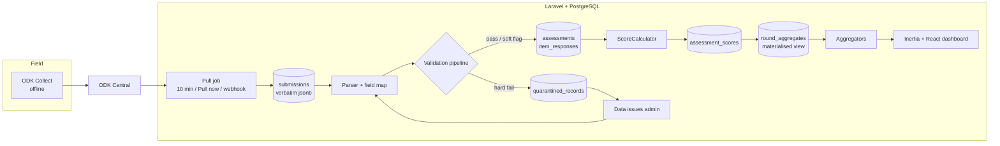
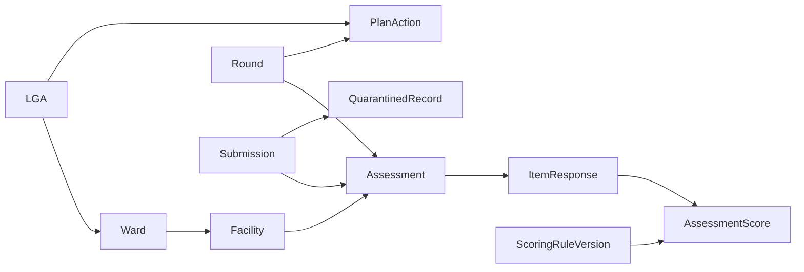
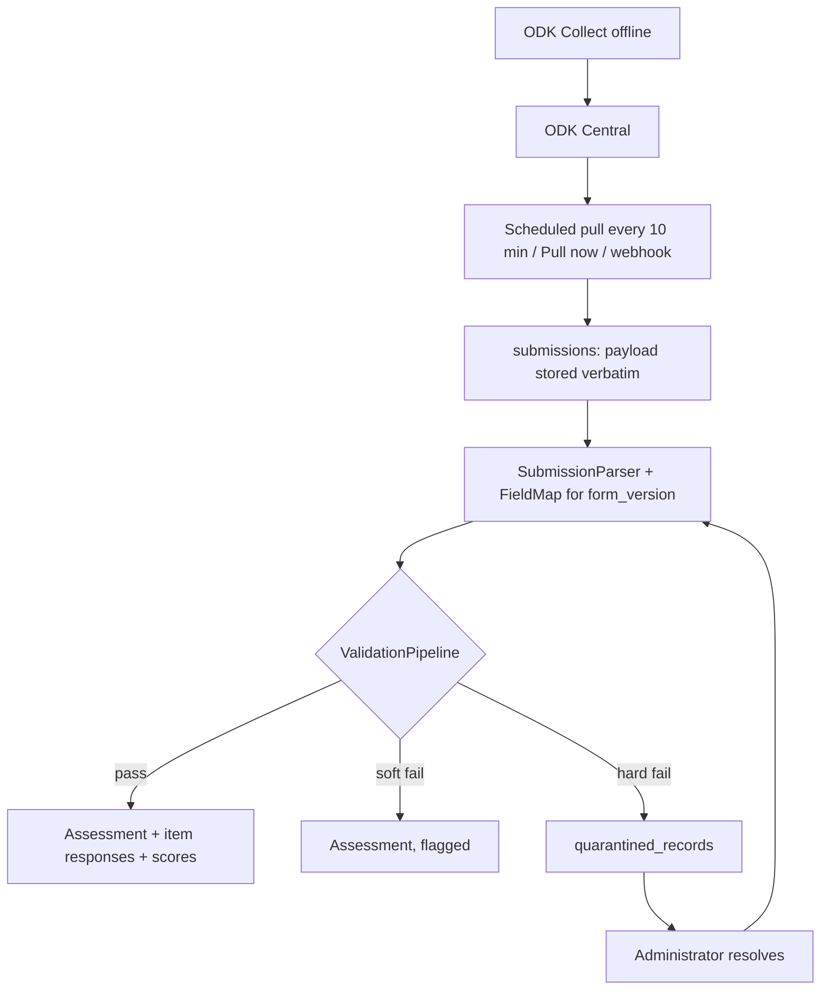

# ARCHITECTURE.md — Kaduna eDQA Portal

How the system is put together: layers, data flow, domain, schema, ingestion, validation,
scoring, API and page structure. Read the section for the area you are changing before you
change it. Coding style lives in `CONVENTION.md`; security in `SECURITY.md`; accessibility in
`ACCESSIBILITY.md`; servers and pipelines in `DEPLOY.md` (separate DevOps project).

## Contents
1. System overview · 2. Application layers · 3. Domain model · 4. Database · 5. Ingestion ·
6. Validation · 7. Scoring · 8. API · 9. Presentation layer · 10. Non-functional targets ·
11. Decisions, prototype deltas, open questions

---

## 1. System overview



**Governing principle:** a score that cannot be true never reaches a chart. Aggregators read only
`assessments`, `assessment_scores` and `round_aggregates` — never `submissions` or
`quarantined_records`. This separation is structural (separate tables + an architecture test),
not a query filter.

**Goals this architecture serves (from the PRD):**

| # | Goal | Where it is enforced |
|---|---|---|
| G1 | No invalid score ever charts | Validation pipeline (§6), CHECK constraints (§4), table separation |
| G2 | Submission on dashboard ≤ 15 min, no human step | Scheduled pull (§5), debounced aggregate refresh |
| G3 | Scores reproducible | Pure `ScoreCalculator`, verbatim payloads, rule versions (§7) |
| G4 | Exactly 23 LGAs | Seeded `lgas`, `LGA_UNKNOWN` rule, no insert path |
| G5 | Every page renders | Pages read local materialised data; no live external query at view time |
| G6 | Follow-up actionable | `plan_actions` (§9.2.6) |
| G7 | Corrections traceable | Activity log on every write (SECURITY.md §4) |
| G8 | Works on 3G | Server-rendered numbers, deferred charts, JS budget (§10) |

**Deployment:** containerised (Docker images, Compose on one host) — see §2 and `DEPLOY.md`.

**Out of scope for v1:** any source besides ODK Central, roles/permissions, writing back to ODK or
DHIS2, sampling logic, mobile app, multi-state tenancy, DHIS2 comparison, public dashboard.

---

## 2. Application layers

```
app/
  Domain/                      ← all business logic
    Assessment/  Models, Actions, DTOs, Events
    Round/       Models, OpenRound, CloseRound, ReopenRound, MonthSlot
    Facility/    Models (Lga, Ward, Facility), Actions, CascadeExporter
    Ingestion/Odk/  OdkClient, SessionTokenCache, FieldMap, SubmissionParser,
                    PullSubmissionsJob, BackfillOdkSubmissionsJob, FetchAttachmentsJob,
                    PullLock, ProcessSubmissionAction, ReprocessSubmissionAction
    Validation/  Contracts/ValidationRule, Rules/*, ValidationPipeline, ValidationContext,
                 QuarantineAction, ResolveQuarantineAction
    Scoring/     ScoreCalculator, ScoreCard, RuleConfig, Bands, RuleVersion, RescoreRoundJob
    Reporting/   Aggregators/*, ReportFilter, Exporters/*
    Plan/        PlanAction model, Actions
  Actions/Fortify/   2FA enable/confirm/regenerate (hashed recovery codes, D-24)
  Listeners/         AuditAuthenticationEvents
  Models/User.php    Laravel default location (administrators only)
  Support/           Auth/RecoveryCodes, Config/EnvFlag
  Http/
    Controllers/ thin — one per page; validate → Action/Aggregator → Resource
    Requests/    FormRequests (validation only)
    Resources/   Inertia/JSON shapes (no arithmetic)
    Middleware/  EnsureTwoFactorConfirmed, SecurityHeaders, VerifyOdkWebhookSignature
  Console/Commands/  edqa:pull, edqa:backfill, edqa:backfill-report, edqa:rescore,
                     edqa:refresh-aggregates, edqa:admin:create, edqa:admin:disable,
                     edqa:db:apply-grants (post-migrate-grants.sql; the migrate role runs it)
config/edqa.php, config/edqa_field_maps.php
database/sql/round_aggregates.sql
resources/js/pages/{dashboard,admin,auth,settings}/*, components/*, layouts/*, lib/*, types/*,
  routes/ + actions/ + wayfinder/ (generated by Wayfinder, not hand-edited)
lang/en/*.php
Dockerfile                    # targets: base, vendor, assets, app, worker, web, ci, dev
compose.dev.yml               # local development stack
docker/                       # entrypoint.sh, php/*.ini, fpm-pool.conf, caddy/Caddyfile*, postgres/init-dev.sql
database/sql/post-migrate-grants.sql
Makefile                      # make help lists every target
```

**Dependency direction:** `Http → Domain`. Inside Domain: `Reporting → Scoring, Assessment,
Round, Facility` (read-only); `Ingestion → Validation → Scoring → Assessment`. `Reporting` must
not depend on `Ingestion` or `Validation` models (architecture test).

**Events and listeners:**

| Event | Listeners |
|---|---|
| `SubmissionIngested` | log counters on `odk_pull_runs` |
| `SubmissionQuarantined` | bump quarantine badge cache |
| `AssessmentScored` | dispatch debounced `RefreshRoundAggregatesJob`, flush round cache tag |
| `QuarantineResolved` | dispatch `RescoreRoundJob` for the round |
| `RuleVersionPublished` | dispatch `RescoreRoundJob` per affected round |
| `RoundClosed` | refresh materialised view, snapshot |
| `PullFailed` | admin alert, digest entry |

**Queues:** `default` (pull, process), `rescore`, `exports`, `low` (attachments).

**Runtime processes (containers).** The application ships as container images built from one
multi-stage `Dockerfile` (`DEPLOY.md` §6). One image runs every PHP role, chosen by the
entrypoint argument:

| Container | Role | Image | Notes |
|---|---|---|---|
| `web` | Caddy: TLS, static assets, FastCGI to `app` | `edqa-web` | Only container with published ports |
| `app` | PHP-FPM serving Inertia pages and `/api/*` | `edqa-app` | Stateless; can scale to 2+ |
| `worker-default` | `queue:work --queue=default` | `edqa-app` | ODK pull, submission processing |
| `worker-rescore` | `queue:work --queue=rescore` | `edqa-app` | Long jobs; generous stop grace period |
| `worker-exports` | `queue:work --queue=exports,low` | `edqa-worker` | Has Chromium for PDFs |
| `scheduler` | `schedule:work` | `edqa-app` | Exactly one instance |
| `migrate` | one-off: migrate + grants | `edqa-app` | Runs as `edqa_migrator` before each rollout |
| `postgres`, `redis` | data | official images | Internal network only |

Consequences for application code are listed in `CONVENTION.md` §12 (stateless containers, logs
to stderr, persistent files only under `storage/app`, config cached at start not build).

---

## 3. Domain model

### Entities and relationships



| Entity | Key facts |
|---|---|
| **LGA** | Exactly 23, seeded. No runtime insert. |
| **Ward** | Belongs to one LGA. |
| **Facility** | Belongs to one ward (and denormalised `lga_id`). `level` ∈ Primary/Secondary/Tertiary. `ownership` ∈ Public/Private. `is_active` — deactivate, never delete. |
| **Round** | `(year, quarter)` unique. Assessment window `window_start..window_end`. Status `open` or `closed`. |
| **Submission** | One ODK record, verbatim. `instance_id` unique. May be `superseded` by an ODK edit. |
| **Assessment** | Created only from a submission that passed all hard rules. `(round_id, facility_id)` unique. |
| **ItemResponse** | One scored question: `dimension`, `month_slot`, `item_code`, `value`, `is_applicable`. |
| **AssessmentScore** | One row per `(assessment, dimension, month_slot)`. `score numeric(5,2)` or null when the slot is all-N/A. Records `rule_version_id`. |
| **QuarantinedRecord** | Failed submission, all failed rule codes + details, resolution state. |
| **ScoringRuleVersion** | Versioned JSON config (bands, item weights, N/A policy). `draft` until `published_at`. |
| **PlanAction** | Implementation-plan row: LGA, round, dimension, action text, owner, due date, status. |

### Current LGAs (seed list)

Birnin Gwari, Chikun, Giwa, Igabi, Ikara, Jaba, Jema'a, Kachia, Kaduna North, Kaduna South,
Kagarko, Kajuru, Kaura, Kauru, Kubau, Kudan, Lere, Makarfi, Sabon Gari, Sanga, Soba,
Zangon Kataf, Zaria.  **= 23.** Confirm codes against the national facility registry.

### Month-slot mapping

| Quarter | Slot 1 | Slot 2 | Slot 3 |
|---|---|---|---|
| Q1 | January | February | March |
| Q2 | April | May | June |
| Q3 | July | August | September |
| Q4 | October | November | December |

UI rule: show real month names when exactly one quarter is in view; otherwise "Month 1/2/3".
Implement once in `App\Domain\Round\MonthSlot::label(int $quarter, int $slot)` and mirror in
`resources/js/lib/months.ts`.

### Round lifecycle

```
          create                close (snapshot aggregates)
 (none) ────────▶ open ──────────────────────────▶ closed
                   ▲                                  │
                   └──────── reopen (reason) ─────────┘
```

- **open** — submissions whose visit date falls in the window bind to it.
- **closed** — no new submissions bind; aggregates are snapshotted into `round_aggregates`.
  A submission for a closed round quarantines under `ROUND_WINDOW` with detail "round closed".
- **reopen** — requires typed reason, audited, triggers rescore on next close.
- Windows must not overlap between rounds (validated on create/edit).

> The PRD also mentions a "publish state" (PRD §5) and "published rounds" (PRD §8). v1 treats **closed =
> published**. See §11 Decisions D-07.

### Submission lifecycle

```
received ─▶ parsed ─▶ validated ─┬─▶ accepted  (assessment + scores created)
                                 ├─▶ flagged   (accepted with soft flags)
                                 └─▶ quarantined ─┬─▶ reprocessed → accepted/flagged
                                                  └─▶ rejected (reason)
any ─▶ superseded   (ODK edit arrived with deprecatedID = this instance_id)
```

When a submission is superseded after it produced an assessment, the replacement is processed
and the assessment is updated in place (audited) — the `(round, facility)` uniqueness holds.

### Assessor identity

Assessors have no portal account. `assessor_name` and `device_id` come from ODK metadata
(`meta/username` or a form field, `deviceid`). Used for the `ASSESSOR_VOLUME` soft rule and for
display only.

---

## 4. Database — PostgreSQL 16

All timestamps `timestamptz`. All raw payloads `jsonb`. Every migration reversible.

### Tables

| Table | Columns | Constraints / notes |
|---|---|---|
| `users` | id, name, email UQ, password, two_factor_secret, two_factor_recovery_codes, two_factor_confirmed_at, is_active, remember_token, timestamps | Administrators only. No role column |
| `lgas` | id, name UQ, code UQ | Seeded with exactly 23 |
| `wards` | id, lga_id FK, name, code | UQ (lga_id, name) |
| `facilities` | id, code UQ, name, ward_id FK, lga_id FK, level, ownership, is_active, lat numeric(9,6)?, lng numeric(9,6)?, timestamps | `level` / `ownership` CHECK against enum values |
| `rounds` | id, year smallint, quarter smallint, window_start date, window_end date, status, closed_at?, reopened_reason?, timestamps | UQ (year, quarter); CHECK quarter 1–4; CHECK window_end ≥ window_start; status CHECK in ('open','closed') |
| `submissions` | id, instance_id UQ, deprecated_id?, form_id, form_version, payload jsonb, submitted_at, received_at, processed_at?, status, superseded_by_id? | Payload never mutated |
| `assessments` | id, round_id FK, facility_id FK, submission_id FK, assessor_name, device_id?, started_at, ended_at, gps jsonb?, status, flags jsonb default '[]', timestamps | UQ (round_id, facility_id); CHECK ended_at ≥ started_at |
| `item_responses` | id, assessment_id FK cascade, dimension, month_slot smallint, item_code, value, is_applicable bool | CHECK month_slot 1–3; dimension CHECK |
| `assessment_scores` | id, assessment_id FK cascade, dimension, month_slot smallint, score numeric(5,2) NULL, rule_version_id FK, computed_at | CHECK score 0–100; UQ (assessment_id, dimension, month_slot, rule_version_id) |
| `quarantined_records` | id, submission_id FK, instance_id, round_id?, facility_ref?, lga_ref?, payload jsonb, failures jsonb, status, resolution, resolved_by?, resolved_at?, resolution_note?, timestamps | `failures` = `[{code, severity, detail}]` |
| `scoring_rule_versions` | id, version int UQ, config jsonb, created_by?, published_at?, published_reason?, timestamps | Exactly one "current" = max published version. `created_by` is null only for version 1, seeded before any administrator exists |
| `plan_actions` | id, round_id, lga_id, dimension, action_text, assigned_to, due_date, status, notes?, timestamps | UQ (round_id, lga_id, dimension) |
| `odk_form_syncs` | id, project_id, form_id, last_pulled_at?, last_instance_id?, backfill_skip int, last_error?, submission_count, timestamps | The pull cursor |
| `odk_pull_runs` | id, triggered_by?, trigger_type, started_at, finished_at?, fetched, accepted, quarantined, duplicates, error?, outcome | Powers pull history |
| `odk_attachments` | id, submission_id, filename, mime, size, path?, fetched_at?, status | Deferred fetch during backfill |
| `activity_log` | Spatie standard | Append-only (see SECURITY.md) |
| `round_aggregates` | **materialised view** | See below |

> Note on `assessment_scores` uniqueness: the PRD lists UQ `(assessment_id, dimension, month_slot)`.
> Because published rounds keep old-version scores readable, include `rule_version_id` in the
> unique key. See §11 Decisions D-05.

### Constraints (write the failing test first)

```sql
ALTER TABLE assessment_scores ADD CONSTRAINT score_in_range   CHECK (score IS NULL OR (score >= 0 AND score <= 100));
ALTER TABLE assessments       ADD CONSTRAINT visit_dates_ordered CHECK (ended_at >= started_at);
ALTER TABLE item_responses    ADD CONSTRAINT month_slot_valid CHECK (month_slot BETWEEN 1 AND 3);
ALTER TABLE assessment_scores ADD CONSTRAINT score_slot_valid CHECK (month_slot BETWEEN 1 AND 3);
ALTER TABLE rounds            ADD CONSTRAINT quarter_valid    CHECK (quarter BETWEEN 1 AND 4);
ALTER TABLE rounds            ADD CONSTRAINT window_ordered   CHECK (window_end >= window_start);
```

A test inserts `347.66` directly via `DB::table('assessment_scores')->insert(...)` and asserts a
`QueryException` with SQLSTATE `23514` (check_violation).

### Indexes

| Index | Purpose |
|---|---|
| `assessments (round_id, facility_id)` UNIQUE | One assessment per facility per round |
| `submissions (instance_id)` UNIQUE | Idempotency |
| `submissions (deprecated_id)` | Edit chain lookup |
| `item_responses (assessment_id, dimension, month_slot)` | Scoring access path |
| `assessment_scores (assessment_id, dimension, month_slot, rule_version_id)` UNIQUE | |
| `submissions USING gin (payload jsonb_path_ops)` | Payload queries during reprocessing |
| `quarantined_records USING gin (failures)` | Group Data issues by rule code |
| `quarantined_records (status, round_id)` | Open-issues badge |
| `facilities (lga_id) WHERE is_active` | Cascade export |
| `round_aggregates (round_id, scope_type, scope_id, owner_type, level)` UNIQUE | Required for `REFRESH ... CONCURRENTLY` |

### `round_aggregates` materialised view

Columns: `round_id, scope_type ('state'|'lga'|'ward'|'facility'), scope_id, owner_type
('all'|'public'|'private'), level ('all'|...), availability, consistency, validity,
m1, m2, m3, overall, facility_count`.

Built from **accepted assessments only** (`assessments` joined to current-version
`assessment_scores`). Facility score first, then unweighted means of facility scores upward.
Use `COALESCE(scope_id, 0)` / sentinel values so the unique index has no NULLs.

```php
public function up(): void {
    DB::statement(file_get_contents(database_path('sql/round_aggregates.sql')));
    DB::statement('CREATE UNIQUE INDEX round_aggregates_key ON round_aggregates (round_id, scope_type, scope_id, owner_type, level)');
}
public function down(): void {
    DB::statement('DROP MATERIALIZED VIEW IF EXISTS round_aggregates');
}
```

The app runs as `edqa_app`, which does not own the view, so the migration also creates a
`SECURITY DEFINER` function owned by the migrator role:

```sql
CREATE OR REPLACE FUNCTION refresh_round_aggregates() RETURNS void
LANGUAGE plpgsql SECURITY DEFINER SET search_path = public AS $$
BEGIN
    -- The view is created WITH NO DATA, and CONCURRENTLY can't refresh an unpopulated view.
    IF (SELECT ispopulated FROM pg_matviews WHERE matviewname = 'round_aggregates') THEN
        REFRESH MATERIALIZED VIEW CONCURRENTLY round_aggregates;
    ELSE
        REFRESH MATERIALIZED VIEW round_aggregates;
    END IF;
END $$;
REVOKE ALL ON FUNCTION refresh_round_aggregates() FROM PUBLIC;  -- EXECUTE is granted to edqa_app only
```

The view's definition and its assumptions (A1–A6, to confirm against a real round in Phase 3)
are in `database/sql/round_aggregates.sql`.

The app calls `SELECT refresh_round_aggregates()` — never the raw statement. Migrations run in
the one-off `migrate` container, which receives `DB_USERNAME=edqa_migrator`; the app containers
connect as `edqa_app`. After migrating, the same container executes
`database/sql/post-migrate-grants.sql`. All of this is part of the contract with the DevOps
project (`DEPLOY.md` §1.3, §8).

Refresh with `SELECT refresh_round_aggregates();` on `AssessmentScored`
(debounced via a unique queued job), `RoundClosed`, and after rescore.

Filters not covered by the view (e.g. LGA + Level + Owner combined) are answered by Aggregator
SQL over `assessment_scores` with the indexes above; keep the p95 under 1.5 s and cache by round tag.

### Laravel specifics

- `$table->jsonb('payload')`; cast `'payload' => 'array'`.
- `$table->timestampsTz()`.
- Enums: string columns + CHECK, cast to PHP backed enums.
- `Model::preventLazyLoading(! app()->isProduction());`
- `Model::shouldBeStrict()` in local/testing.

### Data volume

5 years × 4 rounds × 2,200 facilities × 9 scores ≈ 400,000 score rows, ~40,000 submissions.
Comfortable for Postgres with these indexes.

---

## 5. ODK ingestion pipeline

ODK Central is the system of record for field submissions. The portal pulls; it never pushes.



### 5.1 ODK form contract

The form must satisfy these. If the current form does not, adapting it is a Phase 1 task.

| Requirement | Why |
|---|---|
| Facility chosen by cascading select LGA → ward → facility, from a CSV media file generated by the portal | Kills free-text names like `2019.00` |
| Scored question names match `^(avail|consist|valid)_m[1-3]_[a-z0-9_]+$` | Dimension and month slot parsed from the name; new questions need no code change |
| Scored questions are `select_one` with a fixed list (`yes` / `no` / `na`) | Scores computed from pass counts, never typed. Kills `347.66` at source |
| `round_year`, `round_quarter` are read-only calculated fields | Not typed by assessors |
| `meta/instanceID` required | Idempotency key |
| `start`, `end` metadata fields | Visit duration, `END_BEFORE_START`, `VISIT_TOO_SHORT` |
| GPS and register photo optional | Stored when present |

Choice mapping (configurable per form version): `yes` → pass, `no` → fail, `na` → not applicable.

### 5.2 Components (`app/Domain/Ingestion/Odk/`)

| Class | Responsibility |
|---|---|
| `OdkClient` | HTTP wrapper. Auth, OData paging, attachment download, retries/timeouts |
| `SessionTokenCache` | `POST /v1/sessions`; caches token until 30 min before expiry |
| `PullLock` | `Cache::lock('odk-pull', 900)` — manual press during a scheduled run queues behind it |
| `PullSubmissionsJob` | Incremental pull. Same job for scheduler, Pull now and webhook |
| `BackfillOdkSubmissionsJob` | Cursor-from-zero pull, checkpointed per page, throttled |
| `FetchAttachmentsJob` | Low-priority queue; downloads deferred attachments |
| `SubmissionParser` | Payload + `FieldMap` → `ParsedSubmission` DTO |
| `FieldMap` | Resolves logical names → question paths for a form version |
| `ProcessSubmissionAction` | Parse → validate → create assessment / quarantine, in one transaction |

### 5.3 Pull mechanics

- **Endpoint:** `GET /v1/projects/{p}/forms/{f}.svc/Submissions?$filter=__system/submissionDate gt {lastPulledAt}&$top=500&$skip={n}&$count=true&$expand=*`
- **Cursor:** `odk_form_syncs.last_pulled_at` advances **only after the whole page commits**.
  A crash mid-page replays that page; `instance_id` uniqueness makes replay harmless.
  Use `ge` with the last timestamp + instance-id de-dup if timestamp ties are observed.
- **Idempotency:** `submissions.instance_id` unique. Duplicate → log (counted in
  `odk_pull_runs.duplicates`) and drop. Use `insertOrIgnore` / `ON CONFLICT DO NOTHING`.
- **Edits:** a record with `meta/deprecatedID` marks the deprecated submission `superseded`,
  keeps it, and processes the replacement (updating the existing assessment in place, audited).
- **Attachments:** `storage/app/odk/{instance_id}/`, on first sight, never re-fetched.
  Deferred during backfill.
- **Retries:** 3 attempts, exponential backoff (`$backoff = [30, 120, 600]`), then `failed()` →
  dead-letter record + admin alert + digest.
- **Progress:** each run writes an `odk_pull_runs` row and updates counters as pages commit;
  the admin page polls `GET /api/odk/pull/{runId}` every 2 s.
- **Schedule:** `Schedule::job(new PullSubmissionsJob(PullTrigger::Scheduled))->everyTenMinutes()->withoutOverlapping();`
- **Latency target:** submission visible on the dashboard ≤ 15 minutes with no human step.

### 5.4 Webhook (optional)

`POST /webhooks/odk` — HMAC-verified (see SECURITY.md §6). It only dispatches
`PullSubmissionsJob(PullTrigger::Webhook)`; it never trusts the webhook body as data. The
scheduled pull always runs regardless.

### 5.5 Form versions and field maps

Every submission records `form_version` (`__system/formVersion`). The parser resolves names via
`config/edqa_field_maps.php`:

```php
return [
    'default' => '2026.1',
    'versions' => [
        '2026.1' => [ /* full map — current form */
            'facility_code' => 'facility/facility_code',
            'lga_code'      => 'facility/lga',
            'ward_code'     => 'facility/ward',
            'round_year'    => 'round_year',
            'round_quarter' => 'round_quarter',
            'started_at'    => 'start',
            'ended_at'      => 'end',
            'assessor'      => 'assessor_name',
            'scored_prefix_pattern' => '/^(avail|consist|valid)_m([1-3])_([a-z0-9_]+)$/',
            'choices'       => ['yes' => 'pass', 'no' => 'fail', 'na' => 'na'],
        ],
        '2021.3' => [ /* additive: only names that differ */
            'facility_code' => 'grp_fac/fac_id',
            'renames' => ['avail_m1_nhmis_summary' => 'avail_m1_nhmis_form'],
        ],
    ],
];
```

**Rule:** a `form_version` with no entry quarantines under `UNKNOWN_FORM_VERSION`. Never fall
back to the default map for an unknown version. Silent misparsing is the worst outcome.

**Phase 0 task:** list every form version in ODK Central (`GET /v1/projects/{p}/forms/{f}/versions`),
download each XLSForm, diff question names. That diff *is* the field map.

### 5.6 Initial backfill

Same client, parser, validation and scoring — cursor set to zero.

- ~40,000 submissions ÷ `$top=500` ≈ 80 pages. Measured in hours.
- Checkpoint after every page into `odk_form_syncs.backfill_skip`. Restart resumes at that page.
- Attachments deferred to `FetchAttachmentsJob` on the `low` queue.
- Historical rounds **created before the backfill runs**. Submissions outside every window →
  `ROUND_WINDOW`, never guessed into the nearest round.
- Throttle: configurable sleep between pages (default 5 s); run out of hours on first pass.
- Command: `php artisan edqa:backfill {--from-page=} {--throttle=5}`.
- Produces the **backfill report** afterwards: per round/year — pulled, accepted, quarantined by
  rule. `php artisan edqa:backfill-report --format=xlsx`.

### 5.7 Reprocessing

`ReprocessSubmissionAction` reads `submissions.payload` (never ODK). Used after a quarantine
correction, a field-map fix, or a scoring rule publish. Idempotent.

---

## 6. Validation rules and quarantine

Every rule is a class implementing `App\Domain\Validation\Contracts\ValidationRule`, registered
in `config/edqa.php` under `validation.rules`. Adding a rule = adding a class + config line.

```php
interface ValidationRule
{
    public function code(): string;            // e.g. 'SCORE_RANGE'
    public function severity(): Severity;       // Hard | Soft
    /** @return list<RuleFailure> empty when passing */
    public function check(ParsedSubmission $s, ValidationContext $ctx): array;
}
```

`ValidationContext` provides the facility master list, rounds, prior assessment scores and
assessor-day counts — loaded once per page of submissions, not per rule (no N+1).

The pipeline runs **every** rule and collects **all** failures (not fail-fast), so the Data
issues page shows every reason at once.

### Rule catalogue (14 rules: 10 hard, 4 soft)

| # | Code | Sev | Passes when | Live-report defect it prevents |
|---|---|---|---|---|
| 1 | `UNKNOWN_FORM_VERSION` | Hard | Form version has a field map. **Runs first; if it fails, skip parse-dependent rules** | Old form parsed with the wrong map |
| 2 | `COLUMN_DRIFT` | Hard | Date fields parse as dates; ward is not a reserved word (`Quarterly`, month names, `null`, numeric) | `Ward = Quarterly`, `Start = FEBRUARY` |
| 3 | `LGA_UNKNOWN` | Hard | LGA resolves to one of the 23 | `null` LGA → 24 LGAs |
| 4 | `FACILITY_UNKNOWN` | Hard | Facility code matches an **active** master-list entry | Facility named `2019.00` |
| 5 | `FACILITY_LGA_MISMATCH` | Hard | Master-list LGA == submitted LGA | Wrong cascading-select pick |
| 6 | `ITEMS_INCOMPLETE` | Hard | All required items present for all 3 dimensions × 3 months | Missing dimension can't be averaged |
| 7 | `SCORE_RANGE` | Hard | Every derived score within 0–100 (defence in depth; DB CHECK is the backstop) | `347.66`, `392.42` |
| 8 | `END_BEFORE_START` | Hard | `ended_at ≥ started_at` | Basic integrity |
| 9 | `ROUND_WINDOW` | Hard | Visit date inside an **open** round's window | Q1 visit landing in Q2 |
| 10 | `DUPLICATE_ASSESSMENT` | Hard | No existing accepted assessment for (round, facility), excluding the one this submission supersedes | Double counting |
| 11 | `SCORE_JUMP` | Soft | Overall within 30 points of facility's previous round | Usually entry error |
| 12 | `ALL_PERFECT` | Soft | Not all nine scores exactly 100 | Form filled without visiting |
| 13 | `VISIT_TOO_SHORT` | Soft | `ended_at − started_at ≥ 20 min` | Rushed/fake visit |
| 14 | `ASSESSOR_VOLUME` | Soft | Assessor ≤ 6 facilities that day | Supervisor attention |

Soft thresholds (30 points, 20 min, 6 facilities) live in `config/edqa.php`.

> The PRD build order says "the thirteen rules from §7" but the PRD §7 table lists 14. Build all 14.
> See §11 Decisions D-06.

### Outcomes

- Any hard failure → `quarantined_records` row (payload copy, `failures` jsonb with every code +
  human-readable detail). No assessment, no item responses, no scores.
- Only soft failures → assessment created, `assessments.flags` lists the codes; shown with a
  "Flagged" tag in the facility drawer and Data issues (soft tab). Contributes to aggregates.
- All pass → assessment created, scored, `AssessmentScored` event.

Detail strings must be specific: `"availability_m1 derived score 347.66 exceeds 100"`,
`"lga was blank"`, `"ward 'Quarterly', start 'FEBRUARY'"`.

### Quarantine workflow (Data issues page)

1. Grouped by rule code, filterable by LGA and round; badge count on the admin tab.
2. Each row: ODK instance ID, rule(s), facility reference, LGA, detail, **deep link to ODK Central**.
3. Actions:
   - **Correct and reprocess** — edit the offending mapped field (stored as a correction overlay,
     never mutating `submissions.payload`), re-run the pipeline. Audited with old/new/reason.
   - **Reject** — typed reason required; excluded permanently; audited.
   - **Override soft flag** — typed justification; audited.
   - **Fix at source** — assessor edits in ODK Central; next pull brings a new instance with
     `deprecatedID`; the quarantined record auto-resolves as `superseded`.
4. **Bulk resolve** rows failing the same rule the same way (one reason applies to all; one audit
   entry per record).
5. Every action writes an audit entry. Nothing is silently fixed.
6. Resolving triggers a rescore of the affected round.

### The guarantee

No aggregate — chart, scorecard, export — reads from `submissions` or `quarantined_records`.
Aggregators read only `assessments` / `assessment_scores` / `round_aggregates`. An architecture
test (Pest `arch()`) asserts `App\Domain\Reporting` does not depend on
`QuarantinedRecord` or `Submission` models.

---

## 7. Scoring engine

### Principles

1. Scores are always derived. A submitted "overall" or score field is ignored.
2. Every score records the `scoring_rule_version` that produced it.
3. Changing a rule never mutates history: it creates a new version and triggers a rescore; old
   scores stay readable for closed rounds.
4. Aggregates are SQL over `assessment_scores` (and the `round_aggregates` view), cached, and
   invalidated by round.
5. Store full precision (`numeric(5,2)`); round **only** at presentation.

### Computation (`ScoreCalculator`)

```
dimension_month_score = items_passed / items_applicable × 100
dimension_score       = mean of non-null month scores
overall_score         = mean(availability, consistency, validity)
```

- Items marked N/A are excluded from numerator **and** denominator.
- If every item in a dimension–month is N/A → that slot score is `NULL`, dimension score is the
  mean of the remaining slots, and the exclusion is recorded (`assessments.flags` gets
  `SLOT_ALL_NA:{dim}:{m}` as an informational note).
- If a whole dimension is null → `ITEMS_INCOMPLETE` (hard) should have caught it; the calculator
  throws `IncompleteAssessmentException` as a safeguard.
- Item weights (from the rule version config) default to 1. With weights:
  `Σ(weight × pass) / Σ(weight × applicable) × 100`.

Pure function: `ScoreCalculator::calculate(ItemResponseSet, RuleConfig): ScoreCard`. No DB
access inside — makes it trivially testable and deterministic (goal G3: two runs on identical
inputs produce identical outputs).

### Aggregation (Aggregators in `app/Domain/Reporting/Aggregators/`)

| Level | Method |
|---|---|
| Facility | Mean of its assessments in the round (normally one) |
| Ward | Unweighted mean of facility scores |
| LGA | Unweighted mean of facility scores |
| Owner type | Unweighted mean within Public / Private |
| State | Unweighted mean of all assessed facilities |

Config: `edqa.aggregation.weighting` = `'unweighted'` (default) | `'facility_count'`.
Every aggregator has a test and is the **only** place a number shown on a page is computed.

Aggregators (suggested):
`StateSummaryAggregator`, `DimensionAggregator`, `OwnerSplitAggregator`, `LgaTableAggregator`,
`FacilityScoresQuery`, `QuarterTrendAggregator`, `MonthSlotAggregator`, `CoverageAggregator`,
`AssessmentWindowAggregator`, `ImplementationPlanAggregator`.

All take a `ReportFilter` DTO (year, quarter, lga, level, owner) built from the URL query string.

### Reference figures (must pass as tests before building UI)

| Group | Avail | Consist | Valid | Mean | Shown |
|---|---|---|---|---|---|
| Public | 92 | 79 | 92 | 87.67 | 88 |
| Private | 75 | 62 | 84 | 73.67 | 74 (**PRD says 73**) |
| State (2,000 pub + 219 priv, unweighted over facilities) | | | | ≈ 86.3 | 86 |

> Note: 73.67 rounds to 74, not 73. The live tool shows 73 — likely because its underlying
> dimension values are unrounded (e.g. 74.7/61.9/83.8) or it truncates. Test against the
> **unrounded** figures from a known client round, and confirm the display rounding rule
> (half-up vs truncate) with the client. See §11 Decisions Q-09.
> Also: (2000×87.67 + 219×73.67)/2219 ≈ 86.29, not 86.5 — still displays 86.

### Bands

Config in the rule version, defaults:

| Band | Range | Tag |
|---|---|---|
| Strong | ≥ 90 | green |
| Acceptable | 80–89.99 | green-muted |
| Review | 70–79.99 | amber |
| Needs action | < 70 | red |

Bands drive table colour, status column, and which LGAs enter the implementation plan.
Changing a band never changes a stored score. Band logic lives server-side
(`App\Domain\Scoring\Bands`); the frontend receives the band key with each number and never
recomputes it.

### Rule versions

- `scoring_rule_versions.config` jsonb: `{ bands, item_weights, na_policy, choice_map }`.
- Edit → new **draft** version. **Publish** requires a typed reason and shows a **preview**:
  number of facilities and LGAs that would change band, per round. Then dispatches rescore.
- Current version = highest published. Closed rounds keep their existing scores readable; the
  dashboard reads the current version by default.

### Rescore

Triggered by: rule version publish, quarantine resolution, assessment correction, manual button.

- `RescoreRoundJob` queued, chunked by 200 assessments, reports progress (`job_batches` /
  Bus::batch).
- Reads item responses → `ScoreCalculator` → upserts `assessment_scores` for the target version.
- Ends with `REFRESH MATERIALIZED VIEW CONCURRENTLY round_aggregates` and cache flush for the round.
- Target: full round (~2,200 assessments) in < 5 minutes.

---

## 8. Internal API surface

Dashboard pages are Inertia; these JSON endpoints serve admin interactivity and exports only.
All require an authenticated administrator session (session cookie + CSRF), 2FA-confirmed unless `EDQA_REQUIRE_2FA=false` (D-26).
No public API, no API tokens in v1.

| Method | Path | Purpose |
|---|---|---|
| GET | `/api/aggregates` | Scores by scope, honouring all five filters |
| GET | `/api/facilities` | Paginated (50), sortable, filterable facility scores |
| GET | `/api/facilities/{id}` | Detail: item responses, history, attachments, audit |
| GET | `/api/rounds` | Rounds and status |
| POST | `/api/rounds/{id}/close` | Close round, snapshot aggregates |
| POST | `/api/rounds/{id}/reopen` | Reopen (reason required) |
| POST | `/api/odk/pull` | Manual pull; returns `{ run_id }` |
| GET | `/api/odk/pull/{runId}` | Progress: fetched, parsed, accepted, quarantined, status |
| GET | `/api/odk/status` | Connection state, last success, cursor position |
| GET | `/api/quarantine` | Quarantined records, grouped or flat |
| POST | `/api/quarantine/{id}/resolve` | `{ action: correct|reject|override, fields?, reason }` |
| POST | `/api/quarantine/bulk-resolve` | Same rule, same resolution, many ids |
| GET | `/api/facility-list` | Master list for admin table |
| POST | `/api/facility-list/export-cascade` | Regenerate ODK cascading-select media |
| POST | `/api/scoring-rules/{id}/preview` | Band-change preview before publish |
| POST | `/api/scoring-rules/{id}/publish` | Publish (reason required), triggers rescore |
| POST | `/api/exports` | Queue an export; returns `{ export_id }` |
| GET | `/api/exports/{id}` | Poll status; returns signed download URL when ready |
| POST | `/webhooks/odk` | Optional, HMAC-signed, outside auth group |

**There is no `POST /api/imports`.** Removing that route is the enforcement of "ODK only".

### Conventions

- Controllers thin: validate via FormRequest → call Action/Aggregator → return JsonResource.
- Errors: Laravel default validation 422 shape; domain errors 409 with `{ code, message }`.
- Filters are query params: `year, quarter, lga, level, owner`, identical names to the dashboard
  URL so a view link can be turned into an export.
- Rate limits: see SECURITY.md §8.

---

## 9. Presentation layer

Visual design tokens are in `CONVENTION.md` §6; accessibility rules in `ACCESSIBILITY.md`. The prototype (`kaduna-edqa-prototype-v4.html`) is the visual reference only.

### 9.1 Layout shell

- Left **rail** (210px, `--color-rail`): KD seal, "eDQA e-tool / Kaduna State", nav:
  **Dashboard**, **Administration**. Footer: assessment count, "Support: HSDF".
  Collapses to a horizontal bar under 760px.
- **Status bar** above the top bar: ODK sync state — green "Last pull 4 min ago · 2,184
  assessments · 12 in quarantine" / amber when > 30 min / red when last pull failed.
  (Replaces the prototype's "Sample data / Import data" bar.)
- Sticky **top bar**: page title + subtitle; **global filter bar** (Year, Quarter, LGA, Level,
  Owner) + Export button; tabs underneath.
- Filters live in the **URL query string** (Inertia `router.get` with `preserveState`,
  `preserveScroll`). Any view is bookmarkable and shareable.
- Content max-width 1280px, padding 22/26px.

### 9.2 Dashboard pages

#### 9.2.1 Home
- **Hero** (270px left / flexible right): Average quality score (64px display), sentence
  "Averaged across N facilities…", 2×2 minis: Facilities visited, Local governments, Facilities
  90+, Facilities under 70.
- Right: "The three dimensions" — horizontal bars for Availability, Consistency, Validity,
  Overall with a Strong-threshold marker; note naming the weakest dimension.
- **Public vs Private** split panel: big overall + 3 dimension minis each.
- **Quality score by quarter** line chart with dashed Strong line.
- **Weakest local governments** — six lowest, value tags.

#### 9.2.2 Facility view
- Segmented metric switcher: Availability / Consistency / Validity / Overall.
- Columns: Facility, LGA, Ward, Owner (tag), Assessed (round + date), Month 1/2/3 (heat, real
  month names when one quarter in view), Overall (band tag).
- **Sorted weakest first** by default. Server-side pagination 50/page, sortable on any column
  (TanStack Table in manual mode).
- Facility name opens the **detail drawer**.

#### 9.2.3 LGA view
- 23-tile grid: name, overall, facility count, left border in band colour, `aria-pressed`
  when selected; click toggles the LGA filter.
- Table: LGA, Facilities, Availability, Consistency, Validity, M1, M2, M3 (heat), Overall,
  Status label.
- Tab badge shows LGA count — must always be ≤ 23.

#### 9.2.4 Monitor
- Public / Private split (same component as Home).
- Facilities visited per LGA — ranked bar list (hand-built SVG/CSS), state-mean marker.
- Coverage by level (Primary / Secondary / Tertiary).
- Assessment window table: rounds in view, first visit, last visit, assessments recorded.

#### 9.2.5 Visuals
- Toggle Overall / Public / Private.
- Three grouped bar charts (Recharts), one per month slot, 4 series across quarters in view,
  x-labels = real month name + quarter.
- Four ranked horizontal bar charts by LGA (hand-built SVG): Overall, Availability,
  Consistency, Validity. Bar colour by band.

#### 9.2.6 Implementation plan
- Per LGA: overall (tag), weakest dimension, its score (heat), standard action, **owner
  (editable)**, **review date (editable)**, **status** (Not started / In progress / Done).
- Standard actions:
  - Availability — Restock HMIS tools; confirm current register set is in place
  - Consistency — On-site mentoring on reconciling the monthly summary against the register
  - Validity — Retraining on data element definitions and correct tool completion
- "Actions by type" summary + "What each action means" reference panel.
- Export to Excel workplan.
- Edits persist to `plan_actions` and are audited (prototype was read-only).

#### 9.2.7 Facility detail drawer
Right-side sheet: score card for current round, item-level responses grouped by dimension ×
month (pass / fail / N/A), round-over-round sparkline, soft flags, attachments (authenticated
URLs), correction audit trail, ODK instance ID with deep link.

### 9.3 Administration pages (five)

| Page | Replaces prototype tab | Content |
|---|---|---|
| **ODK pull** | "Imports" + "Data sources" | Connection status dot, last success, fetched in last pull, round cumulative, last error (HTTP status + time). **Pull now** with live progress (fetched → parsed → accepted → quarantined). Pull history table: time, trigger, retrieved, accepted, quarantined, duration, outcome |
| **Data issues** | "Data issues" | Rule list with counts (reuse prototype's issue rows + "why it exists" text), hard/soft tabs, filters LGA + round, rows with instance ID, rule, facility, LGA, `code`-styled detail; correct/reject/override inline; bulk resolve; ODK deep link |
| **Rounds** | — (new) | List, create (year, quarter, window), close, reopen with reason |
| **Facility list** | "Facility list" | Search, inline edit, deactivate (not delete), **Regenerate ODK cascade file** |
| **Scoring rules** | "Scoring rules" | Band thresholds, item weights, N/A policy; draft → preview band changes → publish with reason |

The admin tab shows a red badge with the open quarantine count.


---

## 10. Non-functional targets

| Area | Target |
|---|---|
| Dashboard response | p95 < 1.5 s server time, any page, all filters |
| First meaningful paint | < 3 s on throttled 3G |
| JS budget | ≤ 300 KB gzipped first load; code-split per page; charts load last |
| Ingestion latency | ≤ 15 min from ODK submission to dashboard |
| Rescore | one round (~2,200 assessments) < 5 min |
| Export | 10,000-row CSV < 30 s, queued with progress |
| Volume | ~40,000 submissions, ~400,000 score rows over 5 years |
| Concurrency | 50 simultaneous users |
| Availability | 99% monthly excl. maintenance window |
| Browsers | Chrome, Edge, Firefox, Safari — current + one prior |
| Responsive | usable from 360px; tables scroll horizontally |
| Accessibility | WCAG 2.1 AA (`ACCESSIBILITY.md`) |
| Localisation | English v1; all strings in language files |

How the 3G target is met: numbers arrive as Inertia props and render before hydration; heavy
blocks use Inertia deferred props; charts are `React.lazy`; fonts self-hosted with
`font-display: swap`; tables paginate server-side at 50 rows.

---

## 11. Decisions, prototype deltas, open questions

### 11.1 Architecture decision records

| ID | Decision | Rationale |
|---|---|---|
| D-01 | ODK Central is the only data source, including history | One parser, one validation path; a second path is a second place validation can be bypassed |
| D-02 | One role: Administrator, 2FA mandatory | Saves ~1 week; audit trail becomes the control |
| D-03 | PostgreSQL 16 | jsonb + GIN, enforceable CHECKs, materialised views |
| D-04 | Unweighted aggregation (config flag) | Matches the live tool's published figures |
| D-05 | `assessment_scores` unique key includes `rule_version_id` | PRD requires old-version scores to remain readable after a rescore; the PRD's 3-column UQ would forbid that |
| D-06 | Build all **14** validation rules | PRD §19 says "thirteen"; §7 table lists 10 hard + 4 soft |
| D-07 | Round "published" = "closed" in v1 | PRD §5 mentions a publish state; §10.3 defines only open → closed |
| D-08 | Quarantine corrections stored as an overlay, not by editing `submissions.payload` | Payload must stay verbatim |
| D-09 | Fonts self-hosted | CSP and 3G performance |
| D-10 | Implementation plan owner/date/status editable, persisted in `plan_actions` | PRD §9.6; prototype was read-only |
| D-11 | Band classification server-side only | One source of truth; prototype's JS band logic is inconsistent |
| D-12 | Tests run on Postgres, never SQLite | Constraint and view behaviour must match production |
| D-13 | **Containerised with Docker**; one multi-stage `Dockerfile`, images promoted by digest; Docker Compose on a single host in staging/production; the same images in local dev and CI | Environment parity, one-command rollback, reproducible hosts, clean handover. Kubernetes rejected as disproportionate for 50 users (`DEPLOY.md` §2.2) |
| D-14 | cPanel/WHM hosting dropped as a fallback | Docker needs host control; cPanel's firewall and port ownership conflict with a container edge |
| D-15 | Caddy replaces Nginx as the web tier | Automatic TLS in a container, HTTP/3, precompressed Brotli for 3G, FastCGI retry during rolling restarts |
| D-16 | Laravel Sail rejected for local dev | Sail's image differs from production; `compose.dev.yml` uses our own `dev` target |
| D-17 | **React 19**, not the React 18 in the PRD | The official starter kit and Inertia 3 ship React 19 (19.3 at scaffold) with the React Compiler; staying on 18 would mean maintaining a fork of the kit. No PRD feature depends on the difference |
| D-18 | **Laravel 13 + Inertia 3**, not Laravel 12 + Inertia 2 | Laravel 12's security support ends ~Feb 2027, at go-live; 13 is supported to ~Mar 2028. The current kit targets 13; its last Laravel 12 version was frozen in Mar 2026. Knock-on: **Pest 4** (Pest 3 needs PHPUnit 11; Laravel 13 uses PHPUnit 12), and **ESLint 9** (`eslint-plugin-jsx-a11y` does not support ESLint 10 yet) |
| D-19 | Wayfinder generates typed route helpers (`resources/js/{actions,routes,wayfinder}`, git-ignored) | Its Vite plugin runs `php artisan wayfinder:generate` at the start of every build. The Docker `assets` stage has no PHP (`DEPLOY.md` §6.2): generate the files in the `vendor` stage, copy them into `assets`, and point the plugin's `command` option at a no-op there |
| D-20 | Starter kit trimmed to what one role with mandatory 2FA needs | Removed: registration, passkeys (a login path around TOTP 2FA), profile edit, delete account, appearance/dark mode, welcome and demo dashboard pages, Sail, `laravel/pao`, `vite-plus` (plain Vite + ESLint + Vitest instead). Kept: Fortify login, password reset, email verification, TOTP 2FA, password confirmation, settings → Security. Packages this adds to the stack: `laravel/fortify`, `laravel/wayfinder`, `larastan/larastan`, `pestphp/pest` + `-plugin-laravel` + `-plugin-arch`; npm: Radix UI primitives, `lucide-react`, `sonner`, `input-otp`, `clsx`/`tailwind-merge`/`class-variance-authority` (kit UI), `eslint` + `typescript-eslint`/`react`/`react-hooks`/`jsx-a11y` plugins, `vitest` |
| D-21 | **Node 24** (`node:24-bookworm-slim`) instead of Node 20 for the `assets` stage, the dev `vite` service and the `worker` image | Node 20 reached end of life in Apr 2026; Vite 8 needs ≥ 20.19. The `worker` copies Node and a pinned Puppeteer from the Node image rather than Debian's `nodejs` package (v18, also end of life). `/usr/bin/node` is symlinked so `BROWSERSHOT_NODE_BINARY` from `DEPLOY.md` §15.2 still works |
| D-22 | Assets precompressed at build with `vite-plugin-compression2` (`.br` + `.gz`) | `DEPLOY.md` §6.1/§10: Caddy serves them with `precompressed br gzip`; Brotli matters on 3G. New npm dev dependency |
| D-23 | Fonts from `@fontsource/archivo` (500/600/700) and `@fontsource/ibm-plex-sans` (400/500/600), bundled by Vite | CONVENTION.md §6 and D-09: self-hosted, so the CSP has no external host (SECURITY.md §8). Replaces the kit's build-time Bunny Fonts download. New npm dependencies |
| D-24 | 2FA recovery codes stored as SHA-256 hashes and shown once, overriding Fortify's encrypted, re-displayable codes | SECURITY.md §2. Custom Fortify actions (enable, confirm, regenerate) and challenge request; Fortify's "show codes" endpoint returns 404. A fast hash suffices: each code carries ~119 bits of randomness. A used code is consumed, not replaced |
| D-25 | The starter kit's UI primitives (shadcn/Radix) and sidebar shell removed | Replaced by our own tokens and components (AppShell, Rail, TopBar, TextField, ErrorSummary). Removed npm packages: 13 `@radix-ui/*`, `class-variance-authority`, `clsx`, `tailwind-merge`, `input-otp`, `lucide-react`, `sonner`, `tw-animate-css`. Re-add a primitive only when a page needs it |
| D-26 | 2FA requirement made switchable: `EDQA_REQUIRE_2FA` (config `edqa.auth.require_two_factor`) | Owner decision, 2026-10-03: no 2FA wanted for now. Amends D-02. Unset or empty means required (fail-safe, as `SESSION_SECURE_COOKIE`); the local `.env` sets false. When off, the `two-factor.confirmed` middleware passes everyone, 2FA can still be set up from Security settings, and an account that has it is still challenged. Tests force it on. New env key for `edqa-infra` (DEPLOY.md §1.3) |
| D-27 | `item_weights` keyed `"<dimension>.<item_code>"`, the same weight in every month slot; unlisted items weigh 1; weights must be positive. The calculator divides before multiplying (`passed / applicable × 100`) and sums items in item-code order | §7 gave no key format. Divide-first keeps a weighted all-pass slot at exactly 100 (× 100 first gave 100.00000000000001, caught by the 1,000-set property test); fixed summing order keeps the result independent of item order (G3). Rule version 1 has no weights, so no stored number changes |
| D-28 | A visit's round is decided by its visit date: `startedAt`, falling back to `submittedAt` when the start did not parse, as a local (Africa/Lagos) day. The date must fall inside exactly one round's window and that round must be open. When the form gives both `round_year` and `round_quarter` and they name a different round, `ROUND_WINDOW` quarantines; a form that gives neither (or only one) is placed by date alone | Owner decision, 2026-10-08 (answers Q-24). Never guess the nearest round (hard rule 12): no window, two overlapping windows, a closed round and a disagreeing form each quarantine with their own detail |

Add new decisions here with the next ID. Any new Composer/npm package needs a line.

### 11.2 Prototype vs PRD — the PRD wins

| Prototype shows | Build instead |
|---|---|
| CSV drag-drop import, template download, import history | ODK pull page with Pull now and pull history |
| Data sources: KoboToolbox, DHIS2, Google Sheets, nightly schedule | ODK only, every 10 min + manual |
| Users & roles page with 4 roles, partner masking | No user management UI; single role |
| Scores entered as numbers per month | Computed from `select_one` item responses |
| Client-side scoring and filtering over all rows | Server-side aggregators + materialised view, paginated tables |
| Facility view capped at 60 rows | Server-side pagination, 50/page |
| Facility list "built from the loaded data" | Master list is the validation authority, edited in admin |
| Plan with fixed owners per dimension | Editable owner, due date, status |
| Status bar "Sample data / Import data" | ODK sync status bar |

Keep from the prototype: visual design, layout, page set, chart types, weakest-first sort,
real month names for single-quarter views, LGA tile grid, Data issues "why it exists" copy.

### 11.3 PRD inconsistencies

1. PRD §15 says the data volume is "trivial for **MySQL**" — should read Postgres.
2. PRD §6 flowchart says "**Officer** resolves" — there is only Administrator.
3. PRD §5 reference math: Private 75/62/84 mean 73.67 displays as 74 with half-up rounding, not 73;
   state weighted figure is ≈ 86.3, not 86.5 (both still show 86). Test against unrounded client data.
4. PRD §19 "thirteen rules" vs 14 in §7 (D-06).
5. `assessment_scores` uniqueness vs rule-version history (D-05).
6. PRD §13 lists API path `/api/facility-list/exportcascade` — use `/export-cascade`.

### 11.4 Open questions for the client

| # | Question | Blocks |
|---|---|---|
| Q-01 | ODK Central (OData) or legacy ODK Aggregate? | Phase 2 |
| Q-02 | Does the form use a cascading facility select and `select_one` scored items? | Phase 2 estimate |
| Q-03 | How are dimensions scored today — pass rate or weighted rubric? | Phase 3 |
| Q-04 | Aggregation weighted or unweighted? | Every number |
| Q-05 | How many form versions exist and how far do names drift? | Backfill estimate |
| Q-06 | Who owns and signs off the facility master list, by when? | Phase 2+ |
| Q-07 | VPS acceptable (Postgres ≥ 14)? Who pays? | Deployment |
| Q-08 | How many administrator logins? (> 3 → revisit roles before launch) | Launch |
| Q-09 | Display rounding: half-up or truncate? (explains 73 vs 74) | Phase 3 tests |
| Q-10 | Round assessment windows for historical quarters — exact dates? | Backfill |
| Q-11 | Webhooks available on their ODK Central host? | Optional latency |
| Q-12 | Standard action texts and default owners for the plan — confirm wording | Phase 6 |
| Q-13 | The portal reports ownership as Public or Private only. Where do faith-based, mission and NGO facilities belong? (Registry values that are neither are left unclassified by `facility_reconcile.py`) | Facility seed, owner filters |
| Q-14 | Who issues codes for facilities the client marks ADD in the reconciliation: the national registry, or the portal? Every master-list facility needs a unique code (`facilities.code` UQ) | Facility seed (step 4) |
| Q-15 | Which LGA and ward code lists are authoritative? The form's choice lists, the registry and the seed must use the same codes (§3 "confirm codes against the registry") | Cascade file, `LGA_UNKNOWN` |
| Q-16 | If a historical form version recorded typed scores instead of per-item answers, those submissions cannot be scored under hard rule 2. Leave them quarantined and report the gap, or exclude those rounds from the backfill? (Arises only if `field_diff.py` finds such a version) **Interim (owner, 2026-10-08):** a submission with `rawNumericScores` and no items quarantines under `ITEMS_INCOMPLETE`; typed values are range-checked by `SCORE_RANGE` but never used as scores, and no path accepts them | Backfill (step 14) |
| Q-17 | Which SMTP relay sends the digest and password-reset mail, and does the hosting provider allow outbound SMTP? (Several block it by default) | Password reset (step 5), digest (step 13), hosting |
| Q-18 | Allowed values for `assessments.status`, `odk_pull_runs.outcome` and `odk_attachments.status`. No enum is documented, so these columns are plain strings with no CHECK yet (factories use `accepted`, none, `pending`). Proposed: assessment `accepted`/`flagged`; pull `running`/`succeeded`/`failed`; attachment `pending`/`fetched`/`failed` | CHECK constraints (CONVENTION.md §3), step 8 |
| Q-19 | Confirm the inferred quarantine values: `QuarantineStatus` `open`/`resolved`; `QuarantineResolution` `reprocessed` / `rejected` / `superseded` ("fixed at source"). Derived from the §6 workflow, not listed anywhere | Data issues page (step 11) |
| Q-20 | Should `assessment_scores` log every create (as SECURITY.md §4 reads) or corrections only, like `item_responses`? Every create means ~9 audit rows per assessment per rescore: several hundred thousand rows at backfill | Audit volume, backfill (step 14) |
| Q-21 | Should production require 2FA? The project owner switched it off for now (D-26, `EDQA_REQUIRE_2FA`). D-02 relied on 2FA to protect a single all-powerful role, and `SECURITY.md` is the client-facing data protection statement, so the client should accept the choice in writing either way | Go-live (`SECURITY.md` §15) |
| Q-22 | The password policy checks new passwords against Have I Been Pwned (`uncompromised()`), which needs outbound HTTPS from the server to `api.pwnedpasswords.com`. Does the hosting allow it? If not, creating an admin and changing a password fail | Hosting, `edqa:admin:create` on the server |
| Q-23 | Does the client ever need an administrator account deleted (for example a data protection request), or is disabling enough? Disabling keeps the audit trail attributable; deleting would leave audit entries without a named actor. Only `edqa:admin:disable` exists | `SECURITY.md` §2 wording, data protection statement |
| Q-24 | Which decides a visit's round: the visit date (the round whose window holds it, as `ROUND_WINDOW` reads) or the form's own `round_year` / `round_quarter` answers? And when both exist and disagree, quarantine or trust one? **Answered (owner, 2026-10-08): the visit date decides; a disagreeing declared round quarantines. See D-28** | — |

### 11.5 Deferred until credentials

Phase 1 (v0.1.0) was built and tested without access to the client's systems. These items wait
for credentials or infrastructure. Each starts once its blocker is supplied:

| Item | Waiting for | Step |
|---|---|---|
| Live ODK Central connection: client, pull job, webhook, attachments | ODK Central URL, a Project Viewer service account, project and form IDs (Q-01, Q-11) | 8 |
| Real field maps for each form version | The form XML for every published version, run through `discovery/form_versions.py` and `field_diff.py` (Q-02, Q-05) | 8 |
| Historical backfill and backfill report | The ODK connection above, and round windows for past quarters (Q-10, Q-16) | 14 |
| DevOps: the CI pipeline (tests in the `ci` image, Trivy, image push), the `edqa-infra` project, server provisioning | Hosting decision and server access (Q-07), CI and registry accounts | 1 (CI part), go-live |
| Deploys to staging and production, and the server-side checks in `SECURITY.md` §15 | The servers above | Go-live |

Until then the local stack runs on synthetic seed data (`DemoAssessmentSeeder`), and nothing in
the code assumes a live ODK host.