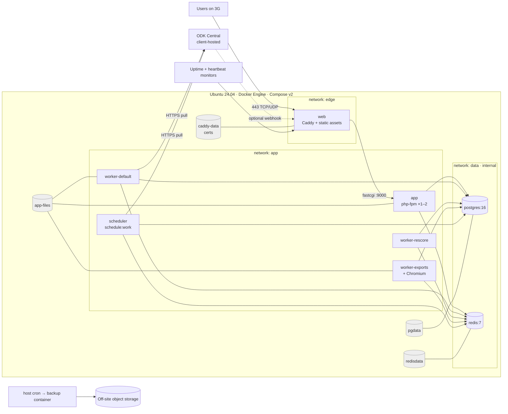
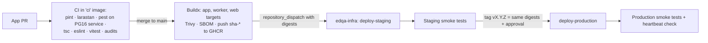

# DEPLOY.md — Kaduna eDQA Portal · DevOps project (containerised)

This document is the specification for the **eDQA DevOps project**: a separate repository
(`edqa-infra`) that provisions Docker hosts, runs the containerised Kaduna eDQA Portal, and
backs up and monitors it. It is self-contained — you should be able to build and run the
infrastructure from this file alone, without reading the application repository.

**Deployment model:** every environment — local, CI, staging, production — runs the **same
container images** built once per commit. Production is a single Docker host running
**Docker Compose**. There is no Kubernetes or Swarm in v1.

## Contents
1. Scope and boundaries · 2. Target architecture · 3. Environments · 4. Hosting decision ·
5. Repository layouts · 6. Container images · 7. Runtime topology (Compose) ·
8. PostgreSQL in containers · 9. Redis · 10. Web tier (Caddy) · 11. Workers and scheduler ·
12. PDF rendering (Chromium) · 13. Host provisioning and hardening · 14. Container security ·
15. Secrets and configuration · 16. CI/CD and release process · 17. Backups and restore ·
18. Monitoring, logging and alerting · 19. Local development · 20. Runbooks ·
21. Checklists · 22. Working in this repo with Claude Code

---

## 1. Scope and boundaries

### 1.1 What the DevOps project (`edqa-infra`) owns
- Docker host provisioning and OS hardening (staging, production)
- Production/staging Compose files, environment templates and secrets on the host
- PostgreSQL and Redis containers, their volumes, tuning, roles and grants
- TLS and the edge (Caddy), DNS records (documented), host firewall
- The deploy pipeline (CD): pull images, migrate, roll out, roll back
- Backups, off-site copies and the restore drill
- Host and container monitoring, uptime checks, log retention and alerting
- Runbooks and client handover documentation

### 1.2 What the application repo owns
- Application code, migrations, tests
- **`Dockerfile`** (multi-stage, all targets), `docker/` (entrypoint, PHP ini, FPM pool,
  Caddyfile) and **`compose.dev.yml`** for local development
- CI: lint, static analysis, tests **inside the `ci` image**, image build, image scan, push to
  the registry
- Application-level security (auth, 2FA, audit trail, CSP headers)
- The schedule definition (`routes/console.php`), daily digest, Pulse

### 1.3 Contract between the two

| The app repo provides | The infra repo provides |
|---|---|
| Images `ghcr.io/<org>/edqa-app`, `edqa-worker`, `edqa-web` tagged `sha-<40 hex>` and `vX.Y.Z` | A host that pulls them and runs them with the right env, volumes and networks |
| One entrypoint supporting roles `app`, `worker`, `scheduler`, `migrate`, `artisan` (§6.3) | Compose services that invoke each role |
| `.env.example` listing every key | Real values per environment, on the host, mode 0600 |
| Migrations that run as whatever `DB_USERNAME` the `migrate` role is given | `edqa_migrator` (DDL) and `edqa_app` (DML only) roles; the `migrate` service runs as the migrator |
| `database/sql/post-migrate-grants.sql`, executed by the `migrate` role after migrating | The grants being correct for the roles it created |
| `SELECT refresh_round_aggregates()` — a `SECURITY DEFINER` function created by migration | The app role having `EXECUTE` on it |
| `GET /up` health route (Laravel default) | Container healthchecks and external uptime checks |
| Logs on stdout/stderr (`LOG_CHANNEL=stderr`) | Log driver, rotation, retention |
| Heartbeat pings (ODK pull success, scheduler alive) using URLs from env | Heartbeat monitor accounts and alert routing |
| Persistent files only under `storage/app` (`odk/`, `exports/`) | A named volume mounted there, included in backups |
| `pcntl` in the image so workers stop gracefully on SIGTERM | `stop_grace_period` ≥ the longest job timeout |

Any change to this table needs a matching issue or PR in the other repo.

### 1.4 Application facts the infrastructure must support

| Fact | Consequence |
|---|---|
| Laravel 12, PHP 8.3 | PHP-FPM 8.3 image with `pdo_pgsql`, `redis`, `intl`, `bcmath`, `gd`, `zip`, `opcache`, `pcntl` |
| PostgreSQL ≥ 14 (16 used) | `postgres:16` container; materialised views, `REFRESH … CONCURRENTLY`, jsonb + GIN, CHECK constraints |
| ODK Central is the only data source | Outbound HTTPS from `app`/`worker`/`scheduler` to the client's ODK Central host |
| Pull every 10 minutes | `scheduler` container must always be running; missed pulls are the #1 operational risk |
| Queues `default`, `rescore`, `exports`, `low` | One worker service per queue group |
| PDF round report via Browsershot | Chromium + Node in the **worker** image only (PDFs are rendered in queued jobs) |
| ODK attachments + exports on disk | `app-files` named volume shared by app and workers |
| Users on 3G | Caddy with HTTP/2 + HTTP/3, gzip/zstd, precompressed Brotli assets, immutable caching |
| 50 concurrent users; ~40k submissions; ~400k score rows | One 4 vCPU / 8 GB host is enough |
| 99% monthly availability | Single host acceptable with tested restore; rolling app restarts with Caddy retry |

---

## 2. Target architecture

### 2.1 Topology (one Docker host per environment)



- Only `web` publishes ports (80, 443/tcp, 443/udp).
- `postgres` and `redis` sit on an `internal: true` network and publish **nothing**.
- `app`, workers and `scheduler` join `app` (outbound allowed) and `data`.

### 2.2 Why Compose on one host (and not Kubernetes/Swarm)
Kubernetes would add a control plane, ingress, storage classes and skills the client doesn't
have, for 50 users on one server. Compose gives the benefits that matter here: identical images
everywhere, one-line rollback to a previous tag, reproducible hosts, and isolation between
processes. It keeps handover realistic.

**Growth path:** Postgres moves to a managed service (change `DB_HOST`), then app/workers can
move to any container platform unchanged.

### 2.3 Sizing

| Env | vCPU | RAM | Disk | Notes |
|---|---|---|---|---|
| Staging | 2 | 4 GB | 60 GB SSD | Postgres `shared_buffers=512MB` |
| Production | 4 | 8 GB | 120 GB SSD | Postgres ~2 GB; room for rescore + Chromium; ~0.5 GB container overhead |

Container memory limits (production starting point):

| Service | Limit | Notes |
|---|---|---|
| postgres | 3 GB | `shared_buffers=2GB` |
| redis | 640 MB | `maxmemory 512mb` |
| app | 1 GB | FPM `pm.max_children=16` × ~50 MB |
| worker-default | 512 MB | |
| worker-rescore | 768 MB | |
| worker-exports | 1.5 GB | Chromium spikes |
| scheduler | 256 MB | |
| web | 128 MB | |

Expected cost: ~$12–25/month per host (Hetzner CPX31, DigitalOcean 4 vCPU/8 GB, Contabo VPS M).
Region: Frankfurt/London/Helsinki for latency to Nigeria, or an in-country provider if the client
requires data residency — check that the provider allows Docker.

---

## 3. Environments

| Env | Where | Images | Data | Deploys |
|---|---|---|---|---|
| Local | Developer machine, `compose.dev.yml` (app repo) | `dev` target, source bind-mounted | Seeded synthetic | n/a |
| CI | GitHub Actions | `ci` target | Postgres 16 service, fixtures | Every PR |
| Staging | `staging.edqa.<client-domain>` | `sha-*` tag | Staging ODK Central project | Automatic on merge to `main` |
| Production | `edqa.<client-domain>` | `vX.Y.Z` tag (same digest as the tested `sha-*`) | Live ODK Central project | Tagged release + manual approval |

Rules:
- Production never runs an image that hasn't run on staging: **promote by digest**, never rebuild.
- Staging never points at the production ODK project.
- `APP_DEBUG=false` everywhere except local.

---

## 4. Hosting decision

Containerisation needs a host where **you control the Docker Engine**.

| Option | Verdict |
|---|---|
| **VPS, Ubuntu 24.04, Docker Engine + Compose v2** | **Recommended.** Everything in this doc applies |
| Client on-premise VM | Fine if it meets the same spec and has outbound HTTPS + a public IP or reverse proxy |
| Managed container platform (e.g. DigitalOcean App Platform, Fly.io) + managed Postgres | Possible later; not needed for v1 |
| cPanel/WHM server | **Not supported.** cPanel's services, firewall and port ownership conflict with a Docker edge proxy. If only a cPanel box exists, provision a separate small VPS |
| Shared hosting | Not viable |

**Verify in week one (Phase 0):**
1. Provider allows Docker (no nested-virtualisation or kernel restrictions; OpenVZ/LXC VPS often
   don't).
2. Kernel ≥ 5.15, cgroups v2, overlay2 storage driver.
3. Outbound HTTPS from the host to ODK Central, GHCR (`ghcr.io`), the SMTP relay and the backup
   storage endpoint.
4. Ports 80/443 (TCP + UDP 443 for HTTP/3) reachable from the internet.
5. Domain/DNS owner identified; who pays for hosting.

---

## 5. Repository layouts

### 5.1 App repo — Docker files it owns

```
Dockerfile                      # multi-stage: base, vendor, assets, app, worker, web, ci, dev
.dockerignore
compose.dev.yml                 # local development
docker/
  entrypoint.sh                 # role dispatcher (§6.3)
  php/
    php.ini                     # production
    php.dev.ini                 # dev overrides (display_errors, xdebug)
    opcache.ini
    fpm-pool.conf               # listen 9000, pm settings, ping.path
  caddy/
    Caddyfile                   # production (TLS by env)
    Caddyfile.dev
  postgres/
    init-dev.sql                # dev/CI only: roles + edqa_test DB
Makefile                        # make up / down / sh / test / artisan / fresh
```

### 5.2 Infra repo (`edqa-infra`)

```
edqa-infra/
  README.md  CLAUDE.md
  ansible/
    inventory/{staging,production}.ini
    group_vars/{all,staging,production,vault}.yml     # vault.yml = ansible-vault
    playbooks/
      provision.yml          # base + hardening + docker + deploy user + dirs
      stack.yml              # renders compose + env, pulls, first start
    roles/
      base/  hardening/  docker/  firewall/  stack/  backup/  monitoring/
  stack/
    compose.yml              # base definition (all services)
    compose.staging.yml      # overrides: limits, hostnames
    compose.production.yml
    env/
      app.env.j2             # Laravel env
      postgres.env.j2
    postgres/
      initdb/01-roles.sql.j2 # roles, db, default privileges (first boot only)
      postgresql.conf.j2
    redis/redis.conf.j2
  images/
    backup/Dockerfile        # postgres:16 + age + rclone + scripts
  scripts/
    deploy.sh  rollback.sh  backup.sh  restore.sh  restore-drill.sh  healthcheck.sh
  .github/workflows/
    lint.yml                 # ansible-lint, yamllint, shellcheck, hadolint, compose config
    deploy-staging.yml  deploy-production.yml  restore-drill.yml
  runbooks/  docs/handover.md
```

On each host the stack lives in `/opt/edqa/`:
```
/opt/edqa/
  compose.yml  compose.override.yml -> compose.<env>.yml
  .env                  # compose variables: IMAGE_TAG, DOMAIN, … (0600)
  app.env               # Laravel env (0600)
  postgres.env          # POSTGRES_PASSWORD etc. (0600)
  postgres/initdb/  postgres/postgresql.conf  redis/redis.conf
  scripts/  .release     # current and previous IMAGE_TAG
```

---

## 6. Container images

Built by the **app repo** CI from one multi-stage `Dockerfile`. Base images are pinned by digest
(Renovate keeps them current).

### 6.1 Targets

| Target | Based on | Contents | Used by |
|---|---|---|---|
| `base` | `php:8.3-fpm-bookworm` | PHP extensions, non-root user, prod `php.ini`, opcache | internal |
| `vendor` | `base` + Composer | `composer install --no-dev` | internal |
| `assets` | `node:20-bookworm-slim` | `npm ci && npm run build` (+ `.br`/`.gz` precompressed) | internal |
| **`app`** | `base` | code + vendor + `public/build`, entrypoint, `opcache.validate_timestamps=0` | `app`, `scheduler`, `migrate`, workers `default`/`rescore` |
| **`worker`** | `app` | + Node 20, Chromium, fonts, Puppeteer | `worker-exports` (PDF) |
| **`web`** | `caddy:2` | Caddyfile + `public/` (static files only, no PHP) | `web` |
| `ci` | `app` | + dev Composer deps, Pest, Larastan, Pint | CI |
| `dev` | `base` | + Composer, dev deps, Xdebug (off by default), dev ini; source bind-mounted | local |

Debian (bookworm) rather than Alpine: Chromium and `intl`/ICU behave predictably and the size
difference doesn't matter here.

### 6.2 Dockerfile reference (app repo, abridged)

```dockerfile
# syntax=docker/dockerfile:1.7
ARG PHP_IMAGE=php:8.3-fpm-bookworm
ARG NODE_IMAGE=node:20-bookworm-slim

FROM ${PHP_IMAGE} AS base
COPY --from=mlocati/php-extension-installer:2 /usr/bin/install-php-extensions /usr/local/bin/
RUN install-php-extensions pdo_pgsql redis intl bcmath gd zip opcache pcntl \
 && apt-get update && apt-get install -y --no-install-recommends libfcgi-bin \
 && rm -rf /var/lib/apt/lists/*
ARG UID=1000 GID=1000
RUN groupmod -o -g ${GID} www-data && usermod -o -u ${UID} -g www-data www-data
COPY docker/php/php.ini docker/php/opcache.ini /usr/local/etc/php/conf.d/
COPY docker/php/fpm-pool.conf /usr/local/etc/php-fpm.d/zz-edqa.conf
WORKDIR /var/www/html

FROM base AS vendor
COPY --from=composer:2 /usr/bin/composer /usr/bin/composer
COPY composer.json composer.lock ./
RUN composer install --no-dev --no-scripts --no-autoloader --prefer-dist --no-interaction
COPY . .
RUN composer dump-autoload --optimize --classmap-authoritative --no-dev

FROM ${NODE_IMAGE} AS assets
WORKDIR /build
COPY package.json package-lock.json ./
RUN npm ci
COPY . .
# If the Vite config calls `php artisan` (e.g. Wayfinder route generation), generate those files
# in the vendor stage and COPY them here instead — there is no PHP in this stage.
RUN npm run build

FROM base AS app
COPY --chown=www-data:www-data --from=vendor /var/www/html /var/www/html
COPY --chown=www-data:www-data --from=assets /build/public/build /var/www/html/public/build
COPY docker/entrypoint.sh /usr/local/bin/edqa-entrypoint
RUN rm -rf tests node_modules .git && chmod +x /usr/local/bin/edqa-entrypoint
USER www-data
EXPOSE 9000
# No HEALTHCHECK here: the same image runs app, workers, scheduler and migrate.
# The FPM healthcheck is declared on the 'app' service in Compose.
ENTRYPOINT ["edqa-entrypoint"]
CMD ["app"]

FROM app AS worker
USER root
RUN apt-get update && apt-get install -y --no-install-recommends chromium nodejs npm \
      fonts-liberation fonts-noto-core \
 && PUPPETEER_SKIP_DOWNLOAD=1 npm install -g puppeteer@<pinned> \
 && rm -rf /var/lib/apt/lists/* /root/.npm
ENV BROWSERSHOT_CHROME_PATH=/usr/bin/chromium BROWSERSHOT_NODE_BINARY=/usr/bin/node
USER www-data
CMD ["worker"]

FROM caddy:2 AS web
COPY docker/caddy/Caddyfile /etc/caddy/Caddyfile
COPY --from=app /var/www/html/public /srv/public
```

`.dockerignore` excludes `.git`, `node_modules`, `vendor`, `storage/*` (except `.gitignore`
placeholders), `.env*`, `tests/Fixtures/odk/private`, `discovery/`.

### 6.3 Entrypoint roles (`docker/entrypoint.sh`)

```bash
#!/usr/bin/env bash
set -euo pipefail
cd /var/www/html
role="${1:-app}"; shift || true

prepare() {
  mkdir -p storage/framework/{cache,sessions,views} storage/logs storage/app/odk storage/app/exports bootstrap/cache
  php artisan optimize --no-interaction >/dev/null     # env differs per environment → cache at start, never at build
}

case "$role" in
  app)       prepare; exec php-fpm -F ;;
  worker)    prepare; exec php artisan queue:work "${QUEUE_CONNECTION:-redis}" \
               --queue="${WORKER_QUEUES:?}" --tries="${WORKER_TRIES:-3}" \
               --timeout="${WORKER_TIMEOUT:-120}" --max-time=3600 --memory="${WORKER_MEMORY:-256}" "$@" ;;
  scheduler) prepare; exec php artisan schedule:work ;;
  migrate)   php artisan migrate --force --no-interaction
             php artisan db:execute-sql database/sql/post-migrate-grants.sql  # app-repo command
             ;;
  artisan)   prepare; exec php artisan "$@" ;;
  *)         exec "$role" "$@" ;;
esac
```

Rules:
- **Never** cache config at build time; never run migrations from the `app` role.
- `migrate` is a one-off container run by the deploy script before new app containers start.
- `db:execute-sql` (or equivalent) is an app-repo command; agree the name with the app team.

### 6.4 Tagging, registry and supply chain
- Registry: **GitHub Container Registry**, private. Host pulls with a read-only token.
- Tags: `sha-<full sha>` on every `main` build; `vX.Y.Z` on release (re-tag, same digest);
  never `latest` in any Compose file.
- Deploys reference images **by digest** (`@sha256:…`) recorded in `/opt/edqa/.release`.
- Build with Buildx + GitHub Actions cache; `linux/amd64` only (add `arm64` only if a host needs it).
- Scan with **Trivy** in CI: fail on fixable HIGH/CRITICAL.
- Generate an SBOM (`docker buildx build --sbom=true`) and provenance attestation.
- `hadolint` on the Dockerfile.

---

## 7. Runtime topology (Compose)

### 7.1 `stack/compose.yml` (infra repo, abridged)

```yaml
name: edqa

x-php: &php
  image: ghcr.io/<org>/edqa-app@${APP_DIGEST}
  env_file: [app.env]
  restart: unless-stopped
  networks: [app, data]
  volumes:
    - app-files:/var/www/html/storage/app
  tmpfs:
    - /var/www/html/storage/framework:uid=1000,gid=1000
    - /var/www/html/storage/logs:uid=1000,gid=1000
    - /var/www/html/bootstrap/cache:uid=1000,gid=1000
    - /tmp
  read_only: true
  security_opt: [no-new-privileges:true]
  cap_drop: [ALL]
  depends_on:
    postgres: { condition: service_healthy }
    redis:    { condition: service_healthy }
  logging: &logging
    driver: local
    options: { max-size: "10m", max-file: "5" }

services:
  web:
    image: ghcr.io/<org>/edqa-web@${WEB_DIGEST}
    restart: unless-stopped
    ports: ["80:80", "443:443", "443:443/udp"]
    environment: { DOMAIN: "${DOMAIN}", ACME_EMAIL: "${ACME_EMAIL}" }
    volumes: [caddy-data:/data, caddy-config:/config]
    networks: [edge, app]
    depends_on: { app: { condition: service_healthy } }
    cap_drop: [ALL]
    cap_add: [NET_BIND_SERVICE]
    logging: *logging

  app:
    <<: *php
    command: ["app"]
    deploy: { resources: { limits: { memory: 1g } } }
    healthcheck:                         # needs ping.path=/ping in fpm-pool.conf
      test: ["CMD-SHELL", "SCRIPT_NAME=/ping SCRIPT_FILENAME=/ping REQUEST_METHOD=GET cgi-fcgi -bind -connect 127.0.0.1:9000 | grep -q pong"]
      interval: 15s
      timeout: 3s
      retries: 3
      start_period: 20s

  worker-default:
    <<: *php
    command: ["worker"]
    environment: { WORKER_QUEUES: "default", WORKER_TIMEOUT: "300" }
    stop_grace_period: 330s

  worker-rescore:
    <<: *php
    command: ["worker"]
    environment: { WORKER_QUEUES: "rescore", WORKER_TRIES: "1", WORKER_TIMEOUT: "900", WORKER_MEMORY: "512" }
    stop_grace_period: 930s

  worker-exports:
    <<: *php
    image: ghcr.io/<org>/edqa-worker@${WORKER_DIGEST}
    command: ["worker"]
    environment: { WORKER_QUEUES: "exports,low", WORKER_TIMEOUT: "600", WORKER_MEMORY: "512" }
    stop_grace_period: 630s
    shm_size: 256m                       # Chromium

  scheduler:
    <<: *php
    command: ["scheduler"]               # exactly one replica — never scale

  migrate:
    <<: *php
    command: ["migrate"]
    restart: "no"
    env_file: [app.env, migrator.env]    # overrides DB_USERNAME/DB_PASSWORD with edqa_migrator
    profiles: [tools]

  postgres:
    image: postgres:16-bookworm@sha256:<pinned>
    env_file: [postgres.env]
    volumes:
      - pgdata:/var/lib/postgresql/data
      - ./postgres/initdb:/docker-entrypoint-initdb.d:ro
      - ./postgres/postgresql.conf:/etc/postgresql/postgresql.conf:ro
    command: ["postgres", "-c", "config_file=/etc/postgresql/postgresql.conf"]
    shm_size: 512m
    networks: [data]
    restart: unless-stopped
    healthcheck:
      test: ["CMD-SHELL", "pg_isready -U postgres -d edqa"]
      interval: 10s
      retries: 5
    logging: *logging

  redis:
    image: redis:7-bookworm@sha256:<pinned>
    command: ["redis-server", "/usr/local/etc/redis/redis.conf"]
    volumes:
      - redisdata:/data
      - ./redis/redis.conf:/usr/local/etc/redis/redis.conf:ro
    networks: [data]
    restart: unless-stopped
    healthcheck:
      test: ["CMD-SHELL", "redis-cli -a \"$$REDIS_PASSWORD\" --no-auth-warning ping | grep PONG"]
      interval: 10s
    env_file: [redis.env]
    logging: *logging

  backup:
    image: ghcr.io/<org>/edqa-backup@${BACKUP_DIGEST}
    env_file: [backup.env]
    volumes:
      - app-files:/files:ro
    networks: [data, app]                # data: reach postgres; app: reach off-site storage
    profiles: [tools]
    restart: "no"

networks:
  edge: {}
  app: {}
  data: { internal: true }

volumes:
  pgdata: {}
  redisdata: {}
  app-files: {}
  caddy-data: {}
  caddy-config: {}
```

Notes:
- `APP_DIGEST`, `WORKER_DIGEST`, `WEB_DIGEST`, `BACKUP_DIGEST`, `DOMAIN` live in `/opt/edqa/.env`,
  written by the deploy script.
- The `app` role binds FPM on `0.0.0.0:9000` inside the `app` network; nothing publishes it.
- `scheduler` must run as **one** container. Laravel's `onOneServer()` is not needed with one
  scheduler, but keep `withoutOverlapping()` on the ODK pull.
- Horizontal scaling later: `docker compose up -d --scale app=2` works (Caddy load-balances via
  DNS); workers scale the same way. The scheduler never scales.

### 7.2 Graceful restarts
- `queue:work` handles SIGTERM via `pcntl`: it finishes the current job, then exits.
  `stop_grace_period` must exceed the job timeout, or long rescores get killed mid-run.
- Caddy retries FastCGI while `app` is recreated (`lb_try_duration 15s`, §10), so a normal
  deploy shows a slow request, not a 502.
- `php artisan queue:restart` is **not** needed — new containers start with new code.

---

## 8. PostgreSQL in containers

### 8.1 Why in a container, and the rules that make it safe
Running Postgres in Docker on a single host is fine **if**:
- data lives on a **named volume** on local SSD (never a bind mount to a network share);
- the image is pinned (`16-bookworm@sha256:…`) and **major upgrades are a planned runbook**
  (`pg_upgrade` or dump/restore), never an unattended image bump;
- backups are logical dumps taken through Postgres (§17), not volume snapshots of a running DB;
- `shm_size` is raised (default 64 MB breaks parallel queries).

### 8.2 First-boot roles (`stack/postgres/initdb/01-roles.sql.j2`)
Runs only when `pgdata` is empty.

```sql
CREATE ROLE edqa_migrator LOGIN PASSWORD '{{ vault_db_migrator_password }}';
CREATE ROLE edqa_app      LOGIN PASSWORD '{{ vault_db_app_password }}';
CREATE DATABASE edqa OWNER edqa_migrator ENCODING 'UTF8' TEMPLATE template0;
\connect edqa
CREATE EXTENSION IF NOT EXISTS pg_trgm;
REVOKE ALL ON SCHEMA public FROM PUBLIC;
GRANT USAGE ON SCHEMA public TO edqa_app;
GRANT ALL   ON SCHEMA public TO edqa_migrator;
ALTER DEFAULT PRIVILEGES FOR ROLE edqa_migrator IN SCHEMA public
  GRANT SELECT, INSERT, UPDATE, DELETE ON TABLES TO edqa_app;
ALTER DEFAULT PRIVILEGES FOR ROLE edqa_migrator IN SCHEMA public
  GRANT USAGE, SELECT ON SEQUENCES TO edqa_app;
```

### 8.3 Post-migration grants (app repo: `database/sql/post-migrate-grants.sql`)
Executed by the `migrate` container after every migration run; idempotent.

```sql
REVOKE UPDATE, DELETE, TRUNCATE ON activity_log FROM edqa_app;   -- append-only audit
REVOKE INSERT, UPDATE, DELETE ON lgas FROM edqa_app;             -- 23 LGAs, seeded only
GRANT EXECUTE ON FUNCTION refresh_round_aggregates() TO edqa_app;
GRANT SELECT ON round_aggregates TO edqa_app;
```

### 8.4 Configuration (`postgresql.conf.j2`, production)
```
listen_addresses = '*'                # safe: only reachable on the internal 'data' network
password_encryption = scram-sha-256
shared_buffers = 2GB
effective_cache_size = 5GB
work_mem = 16MB
maintenance_work_mem = 512MB
max_connections = 100
wal_compression = on
random_page_cost = 1.1
log_min_duration_statement = 500ms
log_line_prefix = '%m [%p] %u@%d '
shared_preload_libraries = 'pg_stat_statements'
```
`pg_hba.conf` (via initdb or a mounted file): `scram-sha-256` for `edqa_app`/`edqa_migrator`
from the Docker subnet only; `reject` everything else.

---

## 9. Redis
- `redis:7`, pinned. Config: `requirepass`, `appendonly yes`, `appendfsync everysec`,
  `maxmemory 512mb`, `maxmemory-policy noeviction` (queues must never be evicted; the cache is
  small and tagged by round).
- Only on the `data` network; no published port.
- Loss of Redis loses in-flight jobs and cache only; the ODK pull is idempotent and replays from
  its cursor.

---

## 10. Web tier (Caddy)

Caddy terminates TLS (automatic Let's Encrypt, stored in `caddy-data`), serves static assets
from its own image, and proxies PHP to `app:9000` over FastCGI.

`docker/caddy/Caddyfile` (app repo):
```
{
    email {$ACME_EMAIL}
    servers { protocols h1 h2 h3 }
}

{$DOMAIN} {
    root * /srv/public
    encode zstd gzip

    header {
        Strict-Transport-Security "max-age=31536000; includeSubDomains"
        -Server
    }
    # CSP, X-Frame-Options, Referrer-Policy, Permissions-Policy are set by the app middleware.

    @build path /build/*
    handle @build {
        header Cache-Control "public, max-age=31536000, immutable"
        file_server { precompressed br gzip }
    }
    @fonts path *.woff2
    header @fonts Cache-Control "public, max-age=31536000, immutable"

    @blocked path /.env* /storage/* /vendor/* /.git/*
    respond @blocked 404

    # Login rate limiting is enforced in the app (RateLimiter); add the caddy-ratelimit module if desired.

    php_fastcgi app:9000 {
        root /var/www/html/public           # path inside the app container
        lb_try_duration 15s                 # ride out app container restarts
        lb_try_interval 250ms
    }
    file_server
    log { output stdout  format json }
}

http://{$DOMAIN} {
    redir https://{host}{uri} permanent
}
```

- Vite builds precompressed `.br` and `.gz` files (e.g. `vite-plugin-compression2`) — Brotli
  matters on 3G.
- Staging can use the same Caddyfile with `DOMAIN=staging.edqa.<domain>`.
- Local dev uses `Caddyfile.dev` on `http://localhost:8080` without TLS.

---

## 11. Workers and scheduler

| Service | Queues | Tries | Timeout | Image | Notes |
|---|---|---|---|---|---|
| `worker-default` | `default` | 3 | 300 s | app | ODK pull, submission processing |
| `worker-rescore` | `rescore` | 1 | 900 s | app | One round in < 5 min target |
| `worker-exports` | `exports`, `low` | 3 | 600 s | **worker** | CSV/Excel/PDF, attachment fetch |
| `scheduler` | — | — | — | app | `schedule:work`; single instance |

Scheduled by the app (reference): ODK pull every 10 min, debounced aggregate refresh, attachment
fetch hourly, daily digest 07:00 WAT, `queue:prune-failed` weekly, scheduler heartbeat every
5 min.

**Infra-owned scheduled jobs** run from **host cron**, not inside Laravel, so they still run if
the app is broken:
```
0 0 * * *   cd /opt/edqa && docker compose run --rm backup backup   >> /var/log/edqa-backup.log 2>&1   # 01:00 WAT
0 3 1 * *   cd /opt/edqa && docker compose run --rm backup drill    >> /var/log/edqa-drill.log 2>&1    # monthly
*/5 * * * * /opt/edqa/scripts/healthcheck.sh --quiet || logger -t edqa "healthcheck failed"
```

---

## 12. PDF rendering (Chromium)

- Only the `worker` image has Chromium + Node + Puppeteer; the web-facing `app` image stays
  small and has no browser.
- Chromium in a container runs with `--no-sandbox` (set via Browsershot `noSandbox()`), because
  the sandbox needs user namespaces or `SYS_ADMIN`, and granting `SYS_ADMIN` is worse. This is
  acceptable **only because** Chromium renders the app's own trusted Blade views of already-
  validated data — never user-supplied URLs or HTML. The app must never pass external URLs to
  Browsershot.
- `shm_size: 256m` on `worker-exports`; Chromium crashes with the 64 MB default.
- Fonts (`fonts-liberation`, `fonts-noto-core`, and the app's self-hosted Archivo / IBM Plex)
  must be present in the image so PDFs match the dashboard.
- Smoke test after each deploy: `docker compose exec worker-exports php artisan edqa:pdf-smoke`
  (app-repo command that renders a one-page PDF to `/tmp`).

---

## 13. Host provisioning and hardening (Ansible)

### 13.1 Base host
- Ubuntu **24.04 LTS**, `unattended-upgrades` for security updates, reboot window Sunday
  03:30 WAT.
- Timezone UTC (app displays WAT via `APP_TIMEZONE=Africa/Lagos`); `systemd-timesyncd`.
- Swap 2 GB.
- **Docker Engine** from Docker's official apt repo (not the Ubuntu `docker.io` package), with
  `docker-compose-plugin` and `docker-buildx-plugin`. Versions pinned in `group_vars/all.yml`.

### 13.2 Docker daemon (`/etc/docker/daemon.json`)
```json
{
  "log-driver": "local",
  "log-opts": { "max-size": "10m", "max-file": "5" },
  "live-restore": true,
  "no-new-privileges": true,
  "userland-proxy": false,
  "default-address-pools": [{ "base": "172.30.0.0/16", "size": 24 }]
}
```
`live-restore` keeps containers running during a Docker daemon upgrade.

### 13.3 Users
| User | Purpose |
|---|---|
| `deploy` | SSH for CD; member of `docker` group; owns `/opt/edqa`. **Membership of `docker` is root-equivalent** — the key lives only in the GitHub `production` environment secret |
| Named admins | One per human; key-only; sudo |

### 13.4 Hardening
- SSH key-only, `PermitRootLogin no`, `PasswordAuthentication no`, `AllowUsers`.
- `fail2ban` for `sshd`.
- **Firewall and Docker:** Docker writes its own iptables rules and **bypasses ufw** for any
  published port. Therefore:
  1. Only `web` publishes ports (80, 443/tcp, 443/udp). Postgres, Redis and PHP-FPM publish
     **nothing** — review every Compose change for a stray `ports:`.
  2. ufw allows 22, 80, 443/tcp, 443/udp inbound; default deny.
  3. Add a `DOCKER-USER` chain rule dropping inbound traffic to container ports other than
     80/443 from the public interface (Ansible `firewall` role), as a second line of defence.
  4. Verify from outside with `nmap -p- <host>` before go-live: only 22, 80, 443 open.
- Automatic cleanup: weekly `docker image prune -af --filter "until=720h"` (keeps images
  from the last 30 days for rollback).

---

## 14. Container security

| Control | Setting |
|---|---|
| Non-root | All PHP containers run as `www-data` (uid 1000). Caddy runs with only `NET_BIND_SERVICE` |
| Read-only root filesystem | `read_only: true` on PHP services; writable paths are the `app-files` volume and tmpfs mounts |
| Capabilities | `cap_drop: [ALL]`; add back only `NET_BIND_SERVICE` on `web` |
| Privilege escalation | `no-new-privileges:true` (service + daemon default) |
| Docker socket | **Never mounted** into any container (no Watchtower, no Portainer, no socket-reading log viewers in production) |
| Networks | `data` is `internal: true`; DB and cache unreachable from the internet and from `web` |
| Resource limits | Memory limits per service (§2.3); `pids_limit: 512` on PHP services |
| Images | Pinned by digest; Trivy scan gates the build; rebuilt at least monthly for base-image patches even without code changes |
| Secrets | Env files 0600 owned by `deploy`; never baked into images; never in `docker inspect`-visible build args |
| Registry | Private GHCR; host token is read-only (`read:packages`) |
| Chromium | `--no-sandbox` justified in §12; worker never renders external content |

---

## 15. Secrets and configuration

### 15.1 Where secrets live
- Source of truth: `ansible/group_vars/vault.yml` (ansible-vault). Vault password held by ≤ 2
  people in a password manager.
- Rendered on the host to `/opt/edqa/{app,migrator,postgres,redis,backup}.env`, mode 0600,
  owner `deploy`.
- GitHub environment secrets: SSH deploy key, known_hosts, GHCR read token for the host.
- `gitleaks` runs in CI in both repos.

### 15.2 `app.env` keys (Laravel)

```
APP_NAME="Kaduna eDQA"  APP_ENV=production  APP_DEBUG=false  APP_URL=https://edqa.<domain>
APP_KEY=base64:...      APP_PREVIOUS_KEYS=  APP_TIMEZONE=Africa/Lagos
LOG_CHANNEL=stderr      LOG_LEVEL=warning   LOG_STDERR_FORMATTER=Monolog\Formatter\JsonFormatter

DB_CONNECTION=pgsql  DB_HOST=postgres  DB_PORT=5432  DB_DATABASE=edqa
DB_USERNAME=edqa_app DB_PASSWORD=...

REDIS_HOST=redis  REDIS_PASSWORD=...  REDIS_DB=0  REDIS_CACHE_DB=1
QUEUE_CONNECTION=redis  CACHE_STORE=redis
SESSION_DRIVER=database  SESSION_LIFETIME=480  SESSION_ENCRYPT=true  SESSION_SECURE_COOKIE=true

ODK_CENTRAL_URL=https://odk.<client>  ODK_CENTRAL_EMAIL=...  ODK_CENTRAL_PASSWORD=...
ODK_PROJECT_ID=  ODK_FORM_ID=  ODK_WEBHOOK_SECRET=  ODK_PULL_PAGE_SIZE=500  ODK_BACKFILL_THROTTLE=5

MAIL_MAILER=smtp  MAIL_HOST=  MAIL_PORT=587  MAIL_USERNAME=  MAIL_PASSWORD=  MAIL_FROM_ADDRESS=
EDQA_DIGEST_RECIPIENTS=

BROWSERSHOT_CHROME_PATH=/usr/bin/chromium  BROWSERSHOT_NODE_BINARY=/usr/bin/node
HEARTBEAT_ODK_PULL_URL=  HEARTBEAT_SCHEDULER_URL=
```

`migrator.env` contains only `DB_USERNAME=edqa_migrator` and `DB_PASSWORD=...`, layered over
`app.env` for the `migrate` service.

The ODK service account must be a **Project Viewer** (read-only) on the one project.

### 15.3 Rotation

| Secret | When | How |
|---|---|---|
| `APP_KEY` | Suspected compromise only | Move the old key to `APP_PREVIOUS_KEYS` (Fortify 2FA secrets are encrypted with it), set the new key, `docker compose up -d`. Everyone is logged out |
| DB passwords | Yearly / staff change | `ALTER ROLE … PASSWORD` via `docker compose exec postgres psql`, update vault, re-render env, `docker compose up -d` |
| Redis password | Yearly | Update `redis.conf` + `app.env`, restart `redis` then PHP services |
| ODK service password | Yearly / staff change | Client ODK admin resets; update vault; `up -d` |
| GHCR host token | Yearly | New fine-grained token, `docker login` on host |
| Deploy SSH key | Yearly / staff change | New key in GitHub secret + `authorized_keys` |

---

## 16. CI/CD and release process

### 16.1 Pipeline



### 16.2 App repo — build job (abridged)

```yaml
build:
  needs: test
  if: github.ref == 'refs/heads/main'
  runs-on: ubuntu-latest
  permissions: { contents: read, packages: write, id-token: write, attestations: write }
  strategy: { matrix: { target: [app, worker, web] } }
  steps:
    - uses: actions/checkout@v4
    - uses: docker/setup-buildx-action@v3
    - uses: docker/login-action@v3
      with: { registry: ghcr.io, username: ${{ github.actor }}, password: ${{ secrets.GITHUB_TOKEN }} }
    - id: build
      uses: docker/build-push-action@v6
      with:
        target: ${{ matrix.target }}
        tags: ghcr.io/${{ github.repository_owner }}/edqa-${{ matrix.target }}:sha-${{ github.sha }}
        push: true
        sbom: true
        provenance: mode=max
        cache-from: type=gha,scope=${{ matrix.target }}
        cache-to: type=gha,mode=max,scope=${{ matrix.target }}
    - uses: aquasecurity/trivy-action@0.28.0
      with: { image-ref: "ghcr.io/${{ github.repository_owner }}/edqa-${{ matrix.target }}@${{ steps.build.outputs.digest }}", severity: "HIGH,CRITICAL", ignore-unfixed: true, exit-code: "1" }
```

A final job collects the three digests and sends `repository_dispatch` (`app-built`) to
`edqa-infra` with `{ sha, app_digest, worker_digest, web_digest }`.

### 16.3 Infra repo — deploy workflow (staging; production identical with approval)

```yaml
name: deploy-staging
on:
  repository_dispatch: { types: [app-built] }
  workflow_dispatch:
    inputs: { app_digest: {required: true}, worker_digest: {required: true}, web_digest: {required: true} }
concurrency: { group: deploy-staging, cancel-in-progress: false }
jobs:
  deploy:
    runs-on: ubuntu-latest
    environment: staging
    steps:
      - uses: actions/checkout@v4
      - uses: webfactory/ssh-agent@v0.9.0
        with: { ssh-private-key: ${{ secrets.DEPLOY_SSH_KEY }} }
      - run: echo "${{ secrets.KNOWN_HOSTS }}" >> ~/.ssh/known_hosts
      - run: |
          ssh deploy@${{ vars.HOST }} "/opt/edqa/scripts/deploy.sh \
            ${{ github.event.client_payload.app_digest || inputs.app_digest }} \
            ${{ github.event.client_payload.worker_digest || inputs.worker_digest }} \
            ${{ github.event.client_payload.web_digest || inputs.web_digest }}"
      - run: ./scripts/healthcheck.sh https://${{ vars.DOMAIN }}
```

Production: triggered by a release in the app repo (`vX.Y.Z`), `environment: production` with
required reviewers, deploys the **same digests** staging ran.

### 16.4 On-host deploy script (`scripts/deploy.sh`)

```bash
#!/usr/bin/env bash
set -euo pipefail
cd /opt/edqa
APP="$1" WORKER="$2" WEB="$3"
[[ "$APP" =~ ^sha256:[0-9a-f]{64}$ ]] || { echo "bad digest"; exit 1; }

cp .release .release.previous 2>/dev/null || true
export APP_DIGEST="$APP" WORKER_DIGEST="$WORKER" WEB_DIGEST="$WEB"

docker compose pull app worker-exports web

# Pre-deploy backup on production when the release contains migrations
if [[ "${EDQA_ENV}" == production ]] && docker compose run --rm --no-deps migrate php artisan migrate:status --pending | grep -q Pending; then
  docker compose run --rm backup backup --tag "pre-deploy-${APP:7:12}"
fi

docker compose run --rm migrate                              # migrator role + post-migrate grants
docker compose up -d --remove-orphans --wait --wait-timeout 180
printf 'APP_DIGEST=%s\nWORKER_DIGEST=%s\nWEB_DIGEST=%s\n' "$APP" "$WORKER" "$WEB" > .release
# persist digests for compose
grep -v '_DIGEST=' .env > .env.tmp || true; cat .release >> .env.tmp; mv .env.tmp .env; chmod 600 .env

docker compose exec -T worker-exports php artisan edqa:pdf-smoke >/dev/null
echo "Deployed app=$APP"
```

- `--wait` blocks until healthchecks pass; the job fails if they don't.
- Migrations must be **backward compatible** with the previous release (expand → migrate →
  contract), because old app containers keep serving until the new ones are healthy.
- A release with a breaking migration: `docker compose run --rm artisan down --retry=30` before
  migrating, `up` after, in an announced window.

### 16.5 Rollback (`scripts/rollback.sh`)
Read `.release.previous`, export its digests, `docker compose up -d --wait`. Migrations are not
reversed automatically: forward-fix is preferred; `migrate:rollback --step=N` only if the
migration's `down()` is safe; restoring the pre-deploy backup is the last resort
(`runbooks/rollback.md`).

### 16.6 Smoke tests (`scripts/healthcheck.sh`)
- `GET https://<domain>/up` → 200; `GET /login` → 200
- TLS valid > 14 days; HSTS and CSP headers present
- `docker compose ps --format json`: every service `running` and `healthy` where defined
- `docker compose exec -T app php artisan edqa:odk-status` reports reachable

---

## 17. Backups and restore

### 17.1 What is backed up

| Item | How | Frequency | Retention |
|---|---|---|---|
| Postgres `edqa` | `pg_dump -Fc` from the `backup` container over the `data` network | Nightly 01:00 WAT + pre-deploy | 30 daily, 12 monthly |
| `app-files` volume (ODK attachments, exports) | `tar` of the read-only mount | Nightly | 30 days |
| Host config + env | Reproducible from `edqa-infra` + vault | — | Git |

Not backed up: images (in GHCR, by digest), Redis (cache + in-flight jobs; the ODK pull replays).
**Never** back up by copying the `pgdata` volume while Postgres is running.

### 17.2 Backup image (`images/backup/Dockerfile`)
`FROM postgres:16-bookworm` (same major as the server) + `age` + `rclone` + `scripts/`.
Commands: `backup [--tag X]`, `restore <file> <dbname>`, `drill`.

```bash
# backup (inside the container)
set -euo pipefail
STAMP=$(date -u +%F-%H%M)${TAG:+-$TAG}
PGPASSWORD="$BACKUP_DB_PASSWORD" pg_dump -h postgres -U edqa_migrator -Fc edqa \
  | age -r "$AGE_RECIPIENT" | rclone rcat "offsite:edqa-backups/${EDQA_ENV}/db/edqa-$STAMP.dump.age"
tar -czf - -C /files odk \
  | age -r "$AGE_RECIPIENT" | rclone rcat "offsite:edqa-backups/${EDQA_ENV}/files/odk-$STAMP.tgz.age"
curl -fsS -m 10 "$HEARTBEAT_BACKUP_URL" >/dev/null
```
- Encrypted with `age`; the **private key is not on the host** (password manager + a sealed
  printed copy with the client).
- Off-site: S3-compatible storage (Backblaze B2, Wasabi, DO Spaces, Hetzner Storage Box) with
  lifecycle rules for retention and object lock if available.

### 17.3 Restore (`runbooks/restore.md`)
```bash
cd /opt/edqa
docker compose run --rm -e AGE_IDENTITY_FILE=/keys/key.txt -v /root/age:/keys:ro \
  backup restore db/edqa-<stamp>.dump.age edqa_restore
# verify: row counts, 23 LGAs, latest round aggregates, activity_log count
# promote: stop app/workers/scheduler, rename edqa → edqa_old and edqa_restore → edqa,
#          run 'migrate' (applies grants), 'up -d --wait'
```
**RPO 24 h** for admin actions (quarantine resolutions, plan edits). Submissions are
re-pullable from ODK Central, so data received since the last backup is recoverable.
**RTO 4 h**: a new host from Ansible, images from GHCR, data from off-site.

### 17.4 Restore drill
Monthly automated (`backup drill`): restores the latest dump into a scratch database inside the
running Postgres, runs sanity SQL (23 LGAs, row counts > 0, `refresh_round_aggregates()`
succeeds, `activity_log` count ≥ last drill), drops it, pings a heartbeat. A failed drill alerts
like an outage. A **full manual drill onto a fresh host** before go-live and once per quarter.

---

## 18. Monitoring, logging and alerting

| Signal | Source | Alert when |
|---|---|---|
| Site up | External uptime monitor on `/up`, 1 min | 3 consecutive failures |
| TLS expiry | Same | < 14 days |
| **ODK pull heartbeat** | App pings after each successful pull | No ping for 40 min |
| Scheduler heartbeat | App pings every 5 min | No ping for 15 min |
| Backup heartbeat | Backup container | No ping for 26 h |
| Restore drill | Drill | No ping for 32 days |
| Container health | `healthcheck.sh` cron (§11) | Any service unhealthy or restarting > 3×/hour |
| Host disk | Ansible-installed cron / node exporter | > 80% (Docker images and logs are the usual cause) |
| Host memory/load | Provider monitoring or Netdata | > 90% for 10 min |
| OOM kills | `docker events --filter event=oom` in healthcheck | Any |
| Slow queries | `log_min_duration_statement`, `pg_stat_statements`, Pulse | Spike |
| Failed jobs | App daily digest + Pulse | Any in digest |

Logs:
- Every container logs to stdout/stderr; the `local` driver rotates 5 × 10 MB per container.
- Laravel logs JSON to stderr; Caddy access logs JSON to stdout.
- Read with `docker compose logs -f --since 1h <service>`.
- Optional log shipping: Grafana Alloy / Vector container → Loki or Better Stack.
  It must read logs through the Docker logging driver or journald, **never** by mounting the
  Docker socket.
- Never log `.env` values, ODK tokens or `/login` request bodies.

Alert routing: email + one chat channel to the on-call developer; weekly summary to the client
counterpart.

---

## 19. Local development (app repo `compose.dev.yml`)

Developers run the same images locally, so there is no "works on my machine" drift from
production PHP extensions or Postgres behaviour.

```yaml
name: edqa-dev
services:
  app:
    build: { context: ., target: dev, args: { UID: "${UID:-1000}", GID: "${GID:-1000}" } }
    command: ["app"]
    env_file: [.env]
    volumes: [".:/var/www/html"]
    environment: { XDEBUG_MODE: "${XDEBUG_MODE:-off}" }
    depends_on: { postgres: { condition: service_healthy }, redis: { condition: service_started } }
  web:
    image: caddy:2
    ports: ["8080:80"]
    volumes: ["./docker/caddy/Caddyfile.dev:/etc/caddy/Caddyfile:ro", "./public:/srv/public:ro"]
    depends_on: [app]
  vite:
    image: node:20-bookworm-slim
    working_dir: /app
    command: sh -c "npm ci && npm run dev -- --host 0.0.0.0"
    ports: ["5173:5173"]
    volumes: [".:/app"]
  worker:
    build: { context: ., target: dev }
    command: ["artisan", "queue:work", "--queue=default,rescore,exports,low", "--tries=1"]
    env_file: [.env]
    volumes: [".:/var/www/html"]
    depends_on: [app]
  scheduler:
    build: { context: ., target: dev }
    command: ["scheduler"]
    env_file: [.env]
    volumes: [".:/var/www/html"]
    profiles: [scheduler]            # opt-in locally, so ODK isn't pulled every 10 minutes
  postgres:
    image: postgres:16-bookworm
    environment: { POSTGRES_PASSWORD: postgres }
    ports: ["5432:5432"]             # local only
    volumes: ["pgdata:/var/lib/postgresql/data", "./docker/postgres/init-dev.sql:/docker-entrypoint-initdb.d/01.sql:ro"]
    healthcheck: { test: ["CMD-SHELL", "pg_isready -U postgres"], interval: 5s }
  redis:
    image: redis:7-bookworm
  mailpit:
    image: axllent/mailpit
    ports: ["8025:8025"]
volumes: { pgdata: {} }
```

- `init-dev.sql` creates `edqa`, `edqa_test`, `edqa_app` and `edqa_migrator` so local mirrors
  production permissions.
- Vite HMR: `server.hmr.host = 'localhost'`, `server.host = '0.0.0.0'` in `vite.config.ts`.
- Makefile shortcuts:
  `make up` · `make down` · `make sh` (shell in app) · `make test` (Pest against `edqa_test`) ·
  `make artisan c="migrate:fresh --seed"` · `make pdf` (runs the worker image locally to test
  PDFs).
- macOS/Windows: bind-mount performance is acceptable with VirtioFS (Docker Desktop) or
  OrbStack; on Windows keep the repo inside WSL2.
- Laravel Sail was considered and rejected: it uses its own image, which would break parity with
  production.

---

## 20. Runbooks (one file each in `runbooks/`)

| Runbook | Trigger | Summary |
|---|---|---|
| `deploy.md` | Planned release | Check pending migrations → run workflow → watch `--wait` → smoke tests → announce |
| `rollback.md` | Smoke test fails / regression | `rollback.sh`; decide on migrations; incident note |
| `odk-outage.md` | ODK heartbeat missed | Check the ODK pull page; `docker compose exec app curl -I $ODK_CENTRAL_URL`; check credentials and outbound network; the pull resumes from its cursor, no data lost |
| `queue-stuck.md` | Jobs not processing | `docker compose ps`; `logs worker-*`; `exec app php artisan queue:failed`; `restart worker-default`; `queue:retry` |
| `container-restarting.md` | Restart loop / OOM | `docker compose ps`, `docker inspect --format '{{.State.OOMKilled}}'`, raise limit or fix leak |
| `disk-full.md` | Disk > 80% | `docker system df`; prune old images; check the `local` log driver limits; Postgres bloat |
| `postgres-major-upgrade.md` | Planned (e.g. 16 → 17) | Dump → new volume with new image → restore → verify → switch; never an in-place image bump |
| `restore.md` | Data loss / corruption | §17.3 |
| `rotate-secrets.md` | Schedule / compromise | §15.3 |
| `new-host.md` | Disaster / migration | Ansible provision → vault env → `docker login` → restore → deploy current digests |
| `admin-accounts.md` | New/departing admin | `docker compose run --rm artisan edqa:admin:create|disable` (audited); keep ≤ 3 accounts |
| `incident-template.md` | Any incident | Timeline, impact, root cause, actions |

---

## 21. Checklists

### 21.1 Week one (Phase 0)
- [ ] Provider confirmed to support Docker (KVM, not OpenVZ/LXC); region agreed; who pays
- [ ] Domain/DNS owner; `A`/`AAAA` records for staging and production
- [ ] Outbound HTTPS from the host to ODK Central, `ghcr.io`, SMTP, backup storage
- [ ] ODK service account (Project Viewer) created by the client
- [ ] Off-site backup bucket created; `age` keypair generated, private key stored offline
- [ ] Vault password holders named

### 21.2 Staging ready (before app Phase 2 ends)
- [ ] `provision.yml` idempotent (second run = 0 changes); `docker compose config` valid
- [ ] Images build in CI, pass Trivy, push to GHCR
- [ ] Deploy by digest works; `--wait` gates on health; rollback works
- [ ] TLS, headers, `/up` green; HTTP/3 advertised
- [ ] Workers and scheduler running; ODK staging pull succeeds
- [ ] `nmap` from outside shows only 22/80/443
- [ ] Heartbeats wired and alerting

### 21.3 Go-live (app Phase 9)
- [ ] Production provisioned from the same playbooks and Compose files
- [ ] Production runs the exact digests validated on staging
- [ ] `APP_DEBUG=false`; `edqa_app` cannot run DDL, cannot modify `activity_log` or `lgas`
- [ ] Postgres/Redis unreachable from outside (verified); no Docker socket mounted anywhere
- [ ] Backups running, encrypted, off-site; **full restore drill passed on a fresh host**
- [ ] PDF smoke test passes in `worker-exports`
- [ ] Load test: 50 concurrent users, p95 < 1.5 s on dashboard pages
- [ ] Runbooks walked through with the client counterpart; `docs/handover.md` delivered
- [ ] ≤ 3 admin accounts, all with 2FA

---

## 22. Working in this repo with Claude Code

Put this in the infra repo's `CLAUDE.md`:

- Everything is **idempotent**: playbooks twice = zero changes; `deploy.sh` twice with the same
  digests = no-op.
- Images are referenced **by digest**, never `latest`, never mutable tags in Compose.
- No service except `web` may have `ports:` in staging/production files. A CI check greps
  for this.
- Never mount `/var/run/docker.sock` into any container.
- PHP containers keep `read_only`, `cap_drop: [ALL]`, `no-new-privileges`; any exception needs a
  comment and a line in `docs/architecture.md`.
- Secrets only via `ansible-vault` (`vault_` prefix) rendered to 0600 env files; `no_log: true`
  on tasks handling them.
- Bash scripts: `set -euo pipefail`, `shellcheck` clean. Dockerfiles: `hadolint` clean.
- Test with `ansible-playbook --check --diff` and `docker compose config` before applying;
  staging first, always.
- Postgres image major version changes only through `runbooks/postgres-major-upgrade.md`.
- Any change to the §1.3 contract needs a matching issue in the app repo.
- Update the relevant runbook in the same PR as the change.
- Conventional Commits with scopes: `provision`, `docker`, `compose`, `postgres`, `redis`,
  `web`, `backup`, `monitoring`, `ci`, `runbook`, `docs`.